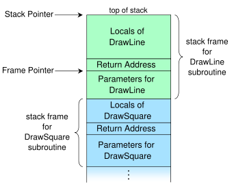

% Functions
% Dr. Andrew Besmer

# Creation

## Creation

* To create (declare) a function you must provide several different pieces
	* Required:
		* **Keyword** - The keyword `function` 
		* **Function Name** - This will be used when you want to call or invoke the function
		* **Body** - List of statements to be executed when the function is invoked
	* Optional:
		* **Parameters** - Variables that will be used in the function
		* **Return Statement** - Data to be passed back to caller

## Creation

* Identify the **keyword**, **function name**, **body**, **parameters**, and **return statement**

```php
<?php

function sayHello()
{
	echo "Hello World!";
}
```

## Creation

* Identify the **keyword**, **function name**, **body**, **parameters**, and **return statement**

```php
<?php

function sayHello($name)
{
	$message = "Hello $name";
	return $message;
}
```


## Parameters

* Specified as an ordered list 
* In PHP, parameters can be unknown length (not covered)

```php
<?php

function sayHello($prefix, $postfix)
{
	return $prefix . " " . $postfix . "\n";
}
```

# Function Use

## Function Use

* Call or invoke function by using it's name with ()

```php
<?php

function sayHello()
{
	echo "Hello World!";
}

sayHello();
```

## Function Use

* When invoking 
	* Must provide **arguments** in the order matching the **parameters**
	* Must also provide the correct number
* Parameters differ from arguments
	* Parameter is the specification
	* Argument is providing the actual value while invoking

## Function Use

* What will result be?

```php
<?php

function sayHello($prefix, $postfix)
{
	return $prefix . " " . $postfix . "\n";
}

echo sayHello("Hello", "World");

echo sayHello("World", "Hello");

echo sayHello("Hello");
```

## Default Arguments

* Sometimes it is not desirable to force arguments to be provided each time
	* Specify the parameter as `NULL` or provide a default value
	* Must be constant expression
	* Can mix some required some not	
	* Passing `NULL` as argument means `NULL`

## Default Arguments

* What will happen?

```php
<?php

function sayHello($prefix = "Hello", $postfix = "there")
{
	return $prefix . " " . $postfix . "\n";
}

echo sayHello("Hello", "World");

echo sayHello("Hello");

echo sayHello();

echo sayHello(NULL, "World");

echo sayHello("Hello", NULL);

echo sayHello(NULL);
```

## Function Use

* Functions can't be redeclared
* What will happen?

```php
<?php

function sayHello()
{
	echo "Hello World!";
}

function sayHello()
{
	echo "Hello World!";
}

sayHello();
```

## Function Use

* Can we do this?

```php
<?php

sayHello();

function sayHello()
{
	echo "Hello World!";
}
```

## Function Use

* Function does not need to appear before using it unlike variables
	* Except: 
		* When declared inside other functions
		* Conditionally declared
* All functions *once created* have global scope (can be used anywhere)
	* Except:
		* Classes/Namespaces (CSCI242)

## Function Use

* The body can call other functions, even itself!

```php
<?php

function getNum()
{
	$num = getFive();
	return $num;
}

function getFive()
{
	return "five";
}

echo "High " . getNum() . "!";
```

## Function Use

* Can call function as part of expression
* Can call function as argument for another function

```php
<?php

function getNum($num)
{
	return $num;
}

function getFive()
{
	return "five";
}

echo "High " . getNum(getFive()) . "!";
```

## Function Use

* Functions can be called in the `return` statement

```php
<?php

function getNum()
{
	return getFive();
}

function getFive()
{
	return "five";
}

echo "High " . getNum() . "!";
```

## Return Statement

* Can only return a 'single' value
* Can provide multiple return statements
	* Only one can be returned though

```php
<?php

function isOvertime($hours)
{
	if($hours > 40)
	{
		return true;
	}
	else
	{
		return false;
	}
}

isOvertime(50); //Hmm...
```

## Return Statement

* Function exits at first return encountered
	* Be careful of bad logic 
* What happens here?

```php
<?php

function isOvertime($hours)
{
	return NULL; //I'm not sure yet let me check

	if($hours > 40)
	{
		return true;
	}
	else
	{
		return false;
	}
}

echo isOvertime(50);
```

# Variable Scope

## Variable Scope

* Variable scope refers to the ability to reference a variable 
* It's an important concept to understand in order to effectively program

## Variable Scope

* In PHP there are three scopes
	* Local - Can only be used within the context it was created
	* Global - Depending on context of use may need to use `global` keyword or `$GLOBALS`
	* Super Global - Can be used anywhere within the program

## Variable Scope

* Local - Generally variables created in functions 
* Global - Generally created within main application
* Super Global - Provided by PHP (there are 9)
	* `$GLOBALS`
	* `$_SERVER`
	* `$_GET`
	* `$_POST`
	* `$_FILES`
	* `$_COOKIE`
	* `$_SESSION`
	* `$_REQUEST`
	* `$_ENV`

## Variable Scope

* What will happen?

```php
<?php

function world()
{
	$world = "world";
}

echo "Hello " . $world;
```

## Variable Scope

* What will happen?

```php
<?php

function world()
{
	$world = "world";
}

world();
echo "Hello " . $world;
```

## Variable Scope

* What will happen?

```php
<?php

function world()
{
	$world = "world";
}

echo "Hello " . world();
```

## Variable Scope

* What will happen?

```php
<?php

$hello = "hello";

function world()
{
	echo $hello . " world";
}

world();
```

## Variable Scope

* What will happen?

```php
<?php

$hello = "hello";

function world()
{
	global $hello;
	echo $hello . " world";
}

world();
```

## Variable Scope

* What will happen?

```php
<?php

$hello = "hello";

function world()
{
	echo $GLOBALS["hello"] . " world";
}

world();
```

## Variable Scope

* What will happen?

```php
<?php

function hello()
{
	$hello = "hello";
}

function world()
{
	$world = "world";
	echo $hello . " " . $world;
}

hello();
world();
```

## Variable Scope

* What will happen?

```php
<?php

function hello()
{
	$hello = "hello";
}

function world()
{
	hello();
	$world = "world";
	echo $hello . " " . $world;
}

world();
```

## Variable Scope

* What will happen?

```php
<?php

function world()
{
	echo $_SERVER["REQUEST_METHOD"];
}

world();
```

## Variable Scope

* Variable scope is highly related to how variables are passed and the call stack, our next topics!

# Passing Arguments

## Pass by Value

* When arguments are passed to functions they are passed by value or copied
	* Exception is objects (CSCI242)
* Even arrays are passed by value, this is different from many other languages

\ 

* What will happen?

```php
<?php

$x = 5;

function changeVar($x)
{
	$x = 12;
	return $x;
}

changeVar($x);

echo $x;
```

## Pass by Value

* What will happen?

```php
<?php

$x = 5;

function changeVar($x)
{
	$x = 12;
	return $x;
}

$x = changeVar($x);

echo $x;
```

## Pass by Value

* Advantage of this method is that function can not modify your variables leading to unexpected results
* Disadvantage is that it uses additional memory for each function call
* There is also overhead as we will see with call stack

## Pass by Reference

* You can pass by reference using an `&` when defining the parameters
	* Some languages let you indicate pass by reference when invoking the function, PHP does not
* When you pass by reference the actual variable is used by the function
* Objects are implicitly by reference (CSCI241)

## Pass by Reference

* What will happen?

```php
<?php

$x = 5;

function changeVar(&$x)
{
	$x = 12;
	return $x;
}

changeVar($x);

echo $x;
```

## Pass by Reference

* What will happen?

```php
<?php

$x = 5;

function changeVar(&$x)
{
	$x = 10;
	changeVar2($x);
	return $x;
}

function changeVar2($x)
{
	$x = 9;
	return $x;
}

changeVar($x);

echo $x;
```

# Call stack

## Call stack

Call Stack

:   Contains information about the current active function calls

* When a function is called a **stack frame** is created and pushed onto call stack
	* Control is passed to the function called
* When a function returns the stack frame is popped off the call stack
	* The return value is given to the caller and control is passed back to the caller
	* All local variables in that frame cease to exist

## Call stack

 [^WikipediaSource]

[^WikipediaSource]: [Wikipedia](http://wikipedia.org)

## Call stack

* Because of memory overhead it is possible to call to many functions at once
	* Particularly with recursion
* This is called **stack overflow** or **smashing the stack**
	* In PHP app will crash
	* In some lower level programming languages this may allow arbitrary execution of code

## Call stack

* Example

```php
<?php

$x = 5;

function changeVar($x)
{
	$x = 12;
	return $x;
}

changeVar($x);

echo $x;
```

## Call stack

* Example

```php
<?php

$x = 5;

function changeVar($x)
{
	$x = 12;
	return $x;
}

$x = changeVar($x);

echo $x;
```

## Call stack

* Example

```php
<?php

$x = 5;

function changeVar(&$x)
{
	$x = 10;
	changeVar2($x);
	return $x;
}

function changeVar2($x)
{
	$x = 9;
	return $x;
}

changeVar($x);

echo $x;
```


# More Functions

## More Built-In
* `abs`
* `ceil`
* `floor`
* `max`
* `min`
* `round`
* `rand`
