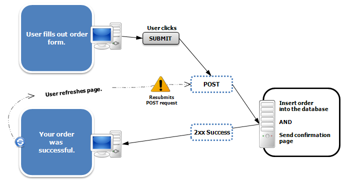

% Includes, PRG, Mail
% Dr. Andrew Besmer

# Scenario

## Scenario

* Todo App

> We will create a todo web app that will link todo items with peoples email addresses.  The todo app will be able to support adding/deleting todo items as well as sending a reminder email, reminding a person of the todo item.  We will do all this using as much reusable code as possible.

# Includes

## Reusable Code

* How many times have you typed the basic html structure?

```html
<!DOCTYPE html>
<html>
	<head>
		<title></title>
	</head>
	<body>
	</body>
</html>
```

## Reusable Code

* So far all code has been in same file
	* Distribution Lab
* Code is unreusable from 
	* Page to page
	* App to app

## Includes/Requires

* Includes & requires to the rescue
	* The `include()` ***asks*** that file be inserted/parsed
		* Absence of the file allows script to continue execute
	* The `require()` ***demands*** that a file be inserted/parsed
		* Absence of a file causes script to have fatal error and terminate

## Includes/Requires

* Lets make a header/footer for our todo app
	* Decide between require/include

```php
<?php
require("header.php");

//Your page stuff here

require("footer.php");
```

## Includes/Requires

* Includes and requires are useful for reusing code
* Lets make reusable code for reading, writing, and deleting from a file[^ReusableFileNote]
	* `readLines()` - Read all the lines from the file
	* `appendLine($line)` - Append a specific line from the file
	* `deleteLine($lineNumber)` - Delete a specific line from the file

[^ReusableFileNote]: OOP or passing the file name would be more suitable than our example but we are not ready for that.

## _once

* Both `include()` and `require()` have similar functions postfixed with `_once`
	* `include_once()`
	* `require_once()`
* Ensures file was included at most 1 time
	* Useful for helper files containing functions
	* Recall functions can be declared only once
* Lets decide if we want to use `_once` or not


# Form Inputs

## Select

* HTML `select` tag is used to provide a list of items from which you can select just one item
	* Visually a drop down list
	* `name` attribute on `option` element used as the key
	* `value` attribute on `option` used to indicate choice
	* Longer text inside `option` tags is only shown to user

```html
<select name="state">
	<option value="NC">North Carolina</option>
	<option value="SC">South Carolina</option>
</select>
```

## Select

* Lets implement the todo app with our generic reader and writer
	* Insert todo item and email (`select`) it belongs to
	* Summary of items

## Hidden

* `hidden` inputs can be used to provide form information that the user does not get to see
	* Useful for security (another class) 
	* Also useful for forms with no visible input

```html
<input type="hidden" name="sku" value="456789"></input>
```

## Hidden

* Lets implement delete functionality using a form
	* A hidden input for todo item number 
	* Button for delete command

\ 

* But first... Why use a form? Why not a link?

\ 

> * `GET` vs `POST` intention
> * Should really use `DELETE` but `GET`/`POST` are the only universally supported **form** methods 
> AJAX can support `DELETE`/`PUT` in many browsers

\ 

> * OK now lets implement

# PRG

## PRG Pattern

PRG
:   Post/Redirect/Get Pattern - solves a common problem with browsers and HTTP POST requests.

 [^PRGImgSrc]

[^PRGImgSrc]: Source: http://upload.wikimedia.org/wikipedia/commons/f/f3/PostRedirectGet_DoubleSubmitProblem.png

## PRG Pattern

* By redirecting can avoid double submission

 [^PRG2ImgSrc]

[^PRG2ImgSrc]: Source: http://upload.wikimedia.org/wikipedia/commons/3/3c/PostRedirectGet_DoubleSubmitSolution.png

## PRG 

* Does our todo app have a double POST problem?
* Lets try inserting and deleteing to find out


## PRG

* How can we fix with PHP

\ 

> * `header()` function
* Lets fix it it

# Mail

## Mail

* Sending mail to users is a common task performed by nearly every web app
* Examples
	* User registration
	* Forgot password
	* New bill generated
	* Todo reminder!

## Mail

* The mail protocol is similar to the http protocol
* Can use the `mail()` function in PHP to send mail
mail function

```php
mail($to, $subject, $message, $headers);
```

## Mail

* `$to` must follow standard
	* besmera@winthrop.edu
	* besmera@winthrop.edu, dannellys@winthrop.edu
	* Andrew Besmer \<besmera@winthrop.edu\>
* `$subject` must contain no `\r\n`

## Mail

* `$message` can contain multiple lines and is used for the message body
* `$headers` while not required can contain additional headers
	* `From: ` is one header you almost certainly want to set

```php
mail("besmera@winthrop.edu", 
"New Account", 
"Welcome to the site!\r\n\r\nVisit us soon...", 
"From: no-reply@winthrop.edu");
```

## Mail

* Lets implement a remind feature
* Address refresh problem
