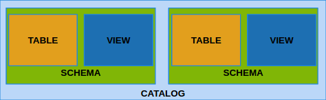
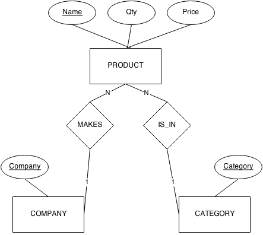
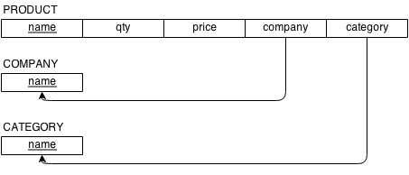
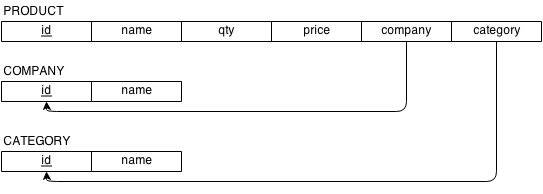

% SQL (Ch 4)
% Dr. Andrew Besmer

# Terms

## DBMS vs Relational

* **Table**, **row**, and **column** instead of relation, tuple, and attribute
	* Lot's of people will still use these interchangeably

\ 

| Relational Model |  DBMS  |
| :--------------: | :----: |
| Relation         | Table  |
| Tuple            | Row    |
| Attribute        | Column |


##  Schema

SQL Schema
:   A set of statements used to define elements in the database. Each statement terminates with a `;`


* We can specify data definitions or schema's using the `CREATE` command
* Elements include:
	* Tables
	* Constraints
	* Views
	* Domains

## Schema
* Within a schema specify a new relation (now a table)
	* Name
	* Attributes
	* Constraints

## Catalog

Catalog
:   A named collection of schemas




```sql
CREATE DATABASE my_besmera2;  -- Catalog

CREATE TABLE Product ( 
	name VARCHAR(255)
); -- Schema
```

# Data Types

## Row Size

* 65,535 is the maximum row size in bytes for MyISAM
	* Total length for all columns added together
	* All varying columns also impact row size because they must store length
	* Columns allowing NULL take up 1 bit extra each, must round up

* `BLOB` and `TEXT` are stored separately from the row
	* Still have impact on row size since length must be stored
	* More later

## Integers
* Integer numbers: `TINYINT`, `SMALLINT`, `MEDIUMINT`, `INT`, `BIGINT`

| Type                  | Bytes | Min                  | Max                  | 
| :---:                 | :---: | ---:                 |  ---:                |
| `TINYINT Signed`      | 1     | -128                 | 127                  |
| `TINYINT Unsigned`    |       | 0                    | 255                  |
| `SMALLINT Signed`     | 2     | -32768               | 32767                | 
| `SMALLINT Unsigned`   |       | 0                    | 65535                |
| `MEDIUMINT Signed`    | 3     |  -8388608            | 8388607              |
| `MEDIUMINT Unsigned`  |       | 0                    | 16777215             |
| `INT Signed`          | 4     | -2147483648          | 2147483647           |
| `INT Unsigned`        |       | 0                    | 4294967295           |
| `BIGINT Signed`       | 8     | -9223372036854775808 | 9223372036854775807  |
| `BIGINT Unsigned`     |       | 0                    | 18446744073709551615 |

## Integers

* Can set display width by setting value, i.e. `SMALLINT(4)` 
	* How much space?
* `BOOLEAN` is really `TINYINT(1)` 
	* How much space?

## Decimals

* Use `DECIMAL` when you want *exact* precision
	* Specify precision (`M`) and scale (`D`)
	* `DECIMAL(M,D)` where $M \in \{1,2,3,...,254\}$ & $D \in \{0,1,2,...30\}$
	* `D` must never exceed `M`
	* `DECIMAL` is the same `DECIMAL(10,0)`
	* What are valid values for `DECIMAL(6,3)`?

## Decimal Storage

* Must calculate based on each side 9 digits at a time

\ 

| Digits | Bytes |
| :----: | :---: |
| 0      | 0     |
| 1–2    | 1     |
| 3–4    | 2     |
| 5–6    | 3     |
| 7–9    | 4     |


## Floats

* Floating point (real) numbers: `FLOAT`, `DOUBLE`
	* `FLOAT` uses 4 bytes, `DOUBLE` uses 8 bytes
	* ***WARNING***: These data types are approximations!
	* Try testing `DOUBLE` against `DECIMAL`

```SQL
INSERT INTO DecimalTest VALUES (.1),(.7);
SELECT floor(sum(val)*10) FROM DecimalTest;
```


<div class="notes">
CREATE TABLE DECTest (val DECIMAL(2,1));
Insert into DecimalTest VALUES (.1),(.7);
Select floor(sum(val)*10) from DECTest;

CREATE TABLE DBLTest ( val DOUBLE );
Insert into DBLTest VALUES (.1),(.7);
Select floor(sum(val)*10) from DBLTest;
</div>


## Time

* `DATE` - 3 bytes
	* YYYY-MM-DD
	* 1000-01-01 to 9999-12-31
* `DATETIME` - 8 bytes
	* YYYY-MM-DD HH:MM:SS[.fraction]
	* Fractional seconds up to six digits
	* Similar range as above
* `TIMESTAMP` - 4 bytes
	* Based on UNIX epoch at 1970-01-01 00:00:01
	* Range ends on 2038-01-19 @ 03:14:07
	* Also has fractional precision
	* Based on UTC and recorded in seconds since the epoch

## Text

* `CHAR(M)`
	* $M$ is number of characters
		* $M \in \{0,1,2,...,255\}$
	* Space padded, see example.
* `VARCHAR(M)` 
	* For ASCII (1B) $M \in \{0,1,2,...,65535\}$
	* For UTF-8 (3B) $M \in \{0,1,2,...,21844\}$ 
* How many bytes needed to store 256 characters of ASCII?
* How many bytes needed to store 256 characters of UTF-8?


## Binary

* `BINARY(M)` 
	* $M$ is number of bytes
	* $M \in \{0,1,2,...,255\}$
* `VARBINARY(M)`
	* $M \in \{0,1,2,...,65535\}$
	* How many bytes need to store 255 bytes?

## Text & Blob

* Contributes 9-12B toward total row size
* 8B + Length Bytes 

\ 

| BLOB         |    TEXT      | Length Bytes | Max Size? |
| :----------: | :----------: | :--------:   | :-------: |
| `TINYBLOB`   | `TINYTEXT`   | 1            | ?         |
| `MEDIUMBLOB` | `MEDIUMTEXT` | 3            | ?         |
| `LONGBLOB`   | `LONGTEXT`   | 4            | ?         |
| `BLOB(M)`    | `TEXT(M)`    | Min Needed   | ?         |


## Row Size

* Calculating total row size
	* If we used `MEDIUMBLOB NOT NULL` how big of a `VARCHAR(M) NOT NULL` could we store?
		* `VARCHAR(M) NULL`?
	* Calculate row size for table

<div class="notes">
Method I used:
Space left in row when using TINYBLOB NOT NULL 65535-(8+1)=65526
Space left in row when using VARCHAR NOT NULL > 255 65526-(2) = 65524Space left in row when using MEDIUMBLOB NOT NULL 65535-(8+3)=65524
Space left in row when using VARCHAR NOT NULL > 255 65524-(2) = 65522
</div>

# Constraints

## Domains

Domain
:   Custom specification of data type to be used by multiple attributes.

* Domains increase schema readability
* MySQL does not support this

```sql
CREATE DOMAIN SSN_TYPE AS CHAR(9);
```

## Basic

* Key and referential constraints
	* `FOREIGN KEY`, `PRIMARY KEY`, `UNIQUE KEY`
* Restrictions on the attribute domain
	* `NOT NULL` 
	* `CHAR(9)`
* Default values
	* `DEFAULT <value>`

## Check

* `CHECK` clause
	* Constraints on individual rows (tuples) within a table (relation)
	* `CHECK` is not supported in MySQL

```sql
CHECK (Dnumber > 0 AND Dnumber < 21)
```

## Key

* `PRIMARY KEY` clause
	* Specifies one or more attributes that makeup the primary key for the table
	* Implicitly says `NOT NULL`
* `UNIQUE` clause
	* Specifies alternate keys
	* NULLs are allowed on this attribute unless you specify `NOT NULL`

```sql
Dnumber INT PRIMARY KEY  -- as part of attribute options
```

```sql
Dname VARCHAR(15) UNIQUE  -- as part of attribute options
```

```sql
PRIMARY KEY (Dnumber)  -- as part of table options
```

```sql
UNIQUE KEY (Dname)  -- as part of table options
```

## Keys

* `FOREIGN KEY` clause
	* Default operation is reject when violated
	* Must provide `REFERENCES` 
	* Can attach referential triggered action to `ON DELETE` or `ON UPDATE`
		* `SET NULL`, `CASCADE`, `RESTRICT` and `SET DEFAULT`

```sql
FOREIGN KEY (super_ssn) REFERENCES (ssn)  -- as part of table options
```

# Creation

## Create Syntax

```sql
CREATE TABLE tbl_name
	( col_name1 TYPE [options],
	col_name2 TYPE [options],
	...
	col_nameN TYPE [options],
	PRIMARY KEY(col_Name),
	FOREIGN KEY (col2_name) REFERENCES tbl2_name(other_col_name)
	); [table_options]  -- Note FK can reference same table too!
```

## Create Table

```sql
CREATE TABLE EMPLOYEE 
	( 
	Fname VARCHAR(15) NOT NULL,
	Minit CHAR(1),
	Lname VARCHAR(15) NOT NULL,
	Ssn CHAR(9) NOT NULL,
	Bdate DATE,
	Address VARCHAR(30),
	Sex CHAR(1),
	Salary DECIMAL(10,2),
	Super_ssn CHAR(9),
	Dno INT NOT NULL,
	PRIMARY KEY (Ssn),
	FOREIGN KEY (Super_ssn) REFERENCES EMPLOYEE(Ssn),
	FOREIGN KEY (Dno) REFERENCES DEPARTMENT(Dnumber)
	);

CREATE TABLE DEPARTMENT
	(
	Dname VARCHAR(15) NOT NULL,
	Dnumber INT NOT NULL,
	Mgr_ssn CHAR(9) NOT NULL,
	Mgr_start_date DATE,
	PRIMARY KEY (Dnumber),
	UNIQUE (Dname),
	FOREIGN KEY (Mgr_ssn) REFERENCES EMPLOYEE(Ssn)
	);
```

## Chicken Egg

* Some FK's may cause errors when creating tables
* How can you fix?

. . . 

```sql
ALTER TABLE tbl_name ADD FOREIGN KEY (col_name) REFERENCES other_tbl(other_col);
```

## Chicken Egg

* Same applies for rows, see `EMPLOYEE.Dno` and `DEPARTMENT.Mgr_ssn`

> Deviation from SQL standards: ... InnoDB checks foreign key constraints immediately; the check is not deferred to transaction commit. According to the SQL standard, the default behavior should be deferred checking. That is, constraints are only checked after the entire SQL statement has been processed. Until InnoDB implements deferred constraint checking, some things will be impossible, such as deleting a record that refers to itself using a foreign key.


# Insertion

## Insert

* Insert data using the `INSERT` statement
	* If using `VALUES` only syntax you MUST specify a value for every column, in order
		* Recall ordered list of values
	* Alternatively can supply the column or attribute names
		* Forms the ordered pair across `VALUES`

```sql
INSERT INTO table_name VALUES (value1,value2,value3,...);
-- OR
INSERT INTO table_name (column1,column2,column3,...) VALUES (value1,value2,value3,...);
```

## Practice

* Lets create a `Product` table with:
	* `name`
	* `quantity`
	* `price` 
* Row size?
* Then fill it with some data

# Retrieval

## Selection

`SELECT`
:   Basic statement used to retreive data from DBMS.

\ 

```sql
SELECT <projection attributes> FROM <tables> WHERE <selection conditions> ORDER BY <attribute list>;
```
\ 

Projection attributes
:   The attribute names whose values will be retrieved by the query. A `*` indicates all.

\ 

Selection condition
:   Boolean expression using relational and logical operators to conditionally return rows retrieved by the query.


## Comparison

* Relational Comparison Operators
	* `=` - note the lack of a double equals
	* `<`, `<=`, `>`, `>=`, and `<>`

* Logical Operators
	* `AND`, `OR`, `NOT`
	* More on `NOT` later

## Comparison/Arithmetic
* `LIKE` comparison operator
	* Used for string pattern matching
	* `%` replaces an arbitrary number of zero or more characters
	* `_` replaces a single character

* Standard arithmetic operators
	* Addition `+`, subtraction `–`, multiplication `*`, and division `/` 

* BETWEEN comparison operator
	* `WHERE DNumber BETWEEN 1 AND 2`


## Order

* DBMS will make no guarantee of the order without an `ORDER BY` clause
	* Can order `ASC` for ascending or `DESC` for descending
	* Can provide multiple attributes to sort on

```sql
SELECT name FROM Product WHERE price > 2 ORDER BY price DESC, name ASC;
```
	
## Duplicates

* SQL does not automatically eliminate ***duplicate rows***
* Use keyword `DISTINCT` with a `SELECT`

```sql
SELECT salary FROM EMPLOYEE;

SELECT DISTINCT salary FROM EMPLOYEE; 
``` 


## Conceptual Steps

* Iterate over each row
* Check selection condition
* Order rows
* Project attributes/columns

```sql
SELECT name FROM Product WHERE price > 2 ORDER BY price;
```

## Views

* Last thing before we practice...

\ 

* Virtual relations can be created as a view

```sql
CREATE VIEW ProductValues AS SELECT qty*price AS value FROM Product;
```

## Practice 

1) What are all the products?
2) Which products have a price greater than or equal to 10.00?
3) Which products are not priced at .99?
4) Which products are priced at .99?
5) Which products are between 5.00 and 10.00?
6) Which products are less than 5.00 or greater than 10.00?

# Modification

## UPDATE

* `UPDATE` Syntax

```sql
UPDATE table SET col1=val1, col2=val2 WHERE col3=val3;
```

* WARNING: Failure to include a WHERE clause will cause it to operate on all rows!!!!


## DELETE

* `DELETE` Syntax 
```sql
DELETE FROM table WHERE col1=val1;
```
* WARNING: Failure to include a WHERE clause will cause it to operate on all rows!!!!

# Multiple Tables

## Selection 

* When selecting from multiple tables you must `JOIN` them
* Types of JOINS
	* `CROSS JOIN` - Cartesian product
	* INNER - Implicit vs Explicit
		* EQUI & NON-EQUI 
			* `INNER JOIN` or `JOIN`
		* NATURAL
			* `NATURAL JOIN`
	* OUTER
		* `LEFT JOIN`
		* `RIGHT JOIN`
		* `FULL JOIN` [^FeatureRequest]

[^FeatureRequest]: [FULL JOIN Bug Report](http://bugs.mysql.com/bug.php?id=18003)


## JOIN PDF

* Refer to `JOIN` PDF

## Ambiguous Attributes

* Same name can be used for two or more attributes (in different relations/tables)
* When selecting must **qualify** the attribute name with relation name
	* `EMPLOYEE.Dnumber`

```sql
SELECT Fname, EMPLOYEE.Name, Address FROM EMPLOYEE, DEPARTMENT
WHERE DEPARTMENT.Name = 'Research' AND DEPARTMENT.Dnumber = EMPLOYEE.Dnumber;
```

## Aliasing

* Alias using the AS keyword

```sql
EMPLOYEE AS E(Fn, Mi, Ln, Ssn, Bd, Addr, Sex, Sal, Sssn, Dno)

-- Now can use Select E.Fn, E.Ln .....

-- MySQL Ex: Select C.id AS i, C.Name AS n FROM Company AS C;
```


## ER Diagram



* Convert to Relations

## Pure Relations



* Make SQL `CREATE TABLE`
* Calculate Row Sizes


## Sensible Relations



* Make SQL `CREATE TABLE`
* Calculate Row Sizes

## SQL

```sql

-- DROP Existing

DROP TABLE Product, Company, Category;

-- Create Product Table

CREATE TABLE Product (
 id SMALLINT UNSIGNED NOT NULL auto_increment,
 name VARCHAR(50) NOT NULL,
 qty SMALLINT NOT NULL,
 price DOUBLE(7,2) NOT NULL,
 company SMALLINT UNSIGNED default NULL,
 category SMALLINT UNSIGNED default NULL,
 PRIMARY KEY  (id)
 ) ENGINE=InnoDB ;

-- Create Category Table

CREATE TABLE Category (
 id SMALLINT UNSIGNED NOT NULL auto_increment,
 name VARCHAR(50) NOT NULL,
 PRIMARY KEY  (id)
) ENGINE=InnoDB ;

-- Add Category Foreign Key

ALTER TABLE Product ADD FOREIGN KEY (category) REFERENCES Category(id);

-- Create Company Table

CREATE TABLE Company (
 id SMALLINT UNSIGNED NOT NULL auto_increment,
 name VARCHAR(50) NOT NULL,
 PRIMARY KEY  (id)
) ENGINE=InnoDB ;

-- Add Company Foreign Key

ALTER TABLE Product ADD FOREIGN KEY (Company) REFERENCES Company(id);

-- Fill Category Table

INSERT INTO Category (name) VALUES ("Toys"), ("Tools"), ("Health");

-- Fill Company Table

Insert INTO Company (name) VALUES ("LEGO"), ("Craftsman"), ("Stanley"), ("Crest");

-- Fill Product Table

Insert INTO Product (name, category, company, qty, price) Select "Batman Lego Set", Category.id, Company.id, 1, 9.99 from Category, Company WHERE Category.name = "Toys" AND Company.name = "LEGO";

Insert INTO Product (name, category, company, qty, price) Select "32 Piece Ratchet Set", Category.id, Company.id, 2, 29.99 from Category, Company WHERE Category.name = "Tools" AND Company.name = "Stanley";

Insert INTO Product (name, category, company, qty, price) Select "Hammer", Category.id, Company.id, 5, 5.99 from Category, Company WHERE Category.name = "Tools" AND Company.name = "Stanley";

Insert INTO Product (name, category, company, qty, price) Select "Toothpaste", Category.id, Company.id, 1, 2.99 from Category, Company WHERE Category.name = "Health" AND Company.name = "Crest";

Insert INTO Product (name, category, company, qty, price) Select "Floss", Category.id, Company.id, .99 from Category, Company WHERE Category.name = "Health" AND Company.name = "Crest";

Insert INTO Product (name, category, company, qty, price) Select "Power Drill", Category.id, NULL, 5, 49.99 from Category WHERE Category.name = "Tools";

Insert INTO Product (name, category, company, qty, price) Select "120 Piece Lego Set", NULL, Company.id, 1, 12.99 from Company WHERE Company.name = "LEGO";

Insert INTO Product (name, category, company, qty, price) Select "Hot-wheels Car", NULL, NULL, 10, .99 ;

```

## JOIN Practice

1) Create a view showing the values of the product on hand.
2) Select all the products and the category that the product is in.
	* Implicit
	* Explicit
3) Select the *product name* and the *category name* of all the products.

## JOIN Practice

4) Select all the products, the categories they belong to, and the company the product is made by. Hint: LEFT LEFT!
	* Update the company Stanley to Stanley Black and Decker and rerun
5) Select all the products in the tools category with a price greater than 10.00.
	* Now only those made by Stanley Black and Decker.
6) Delete the matchbox company.
	* Why did this happen?
	* What can you do? Do it! Try again.


<div class="notes">
	CREATE TABLE Product (
	  id int(11) NOT NULL auto_increment,
	  Name varchar(50) NOT NULL,
	  Qty int(11) NOT NULL,
	  Price double NOT NULL DEFAULT 1.00,
	  Company int(11) default NULL,
	  Category int(11) default NULL,
	  PRIMARY KEY  (id)
	  ) ENGINE=InnoDB ;

	CREATE TABLE Category (
	  id int(11) NOT NULL auto_increment,
	  Name varchar(50) NOT NULL,
	  PRIMARY KEY  (id)
	) ENGINE=InnoDB ;

	ALTER TABLE Product ADD FOREIGN KEY (Category) REFERENCES Category(id);

	CREATE TABLE Company (
	  id int(11) NOT NULL auto_increment,
	  Name varchar(50) NOT NULL,
	  PRIMARY KEY  (id)
	) ENGINE=InnoDB ;

	ALTER TABLE Product ADD FOREIGN KEY (Company) REFERENCES Company(id);
</div>

