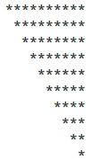

% Intro To PHP Cont.
% Dr. Andrew Besmer

# Operators

## Operators

| Operator | Purpose        | Example    |
| ------   | -------        | -------    |
| `+`      | Addition       | `$x + $y;` |
| `-`      | Substraction   | `$x - $y;` |
| `*`      | Multiplication | `$x * $y;` |
| `/`      | Division       | `$x / $y;` |
| `%`      | Modulus        | `$x % $y;` |
| `=`      | Assignment     | `$x = $y;` |
| `.`      | Concatentation | `$x . $y;` |

\ 

* Modulus Example

## Combined

| Operator | Example     | Becomes         |
| -------  | -------     | --------        |
| `+=`     | `$x += $y;` | `$x = $x + $y;` |
| `-=`     | `$x -= $y;` | `$x = $x - $y;` |
| `*=`     | `$x *= $y;` | `$x = $x * $y;` | 
| `/=`     | `$x /= $y;` | `$x = $x / $y;` |
| `%=`     | `$x %= $y;` | `$x = $x % $y;` |
| `.=`     | `$x .= $y;` | `$x = $x . $y;` |

\ 

* Combined example

## (Inc)(Dec)rement 

| Operator | Purpose   | Example |
| -------  | -------   | ------- |
| `++`     | Increment | `$x++;` |
| `--`     | Decrement | `$x--;` | 

\ 

* Increment or Decrement will increase or decrease the value of the variable by 1
* No assignment is needed since the operator operates directly on the variable
* Can increment or decrement either pre or post
	* Pre before statement and use in expression
	* Post after statement and use in expression

## (Inc)(Dec)rement 

* Examples


# Conditionals

## Code Block

Code Block
:   One or more statements surrounded by curly braces `{` and `}`

```php
<?php

{
	echo "hi";
	echo "csci 241";
}
```

* Use with control structures to indicate which statements to execute 
* When you open a curly you must close it
* Curly braces should surrond complete statements and should not be interspersed

## If Statements

* If statements help control program logic

```php
if(expression)
{
	/*
	* The code in these curly braces run only 
	* if expression is true	
	*/
}
else
{
	/*
	* The code in these curly braces run only 
	* if expression is false	
	*/
}
```

* Which code will run if the expression is `false`?

## If Statements

* Can conditionally condition!

```php
if(expression) //Always checked
{
	//Some code
}
else if(expression2) //Checked only if prior is false
{
	//Some code
}

...

else if(exprssion7) //Checked only if all prior are false
{
	//Some code
}
else //Runs if all tests resulted in false
{
	//Some code
}

```

## Comparrison Operators

| Operator | Purpose               | Example     |
| -------  | -------               | -------     |
| `==`     | Equal                 | `$x == $y;` |
| `!=`     | Not Equal             | `$x != y;`  |
| `<`      | Less Than             | `$x < $y`   |
| `>`      | More Than             | `$x > $y`   |
| `<=`     | Less Than or Equal To | `$x <= $y`  |
| `>=`     | More Than or Equal To | `$x >= $y`  |

## Comparrison Operators

| Operator | Purpose       | Example      |
| -------  | -------       | -------      |
| `===`    | Exactly Equal | `$x === $y;` |

\ 

* Difference between `==` and `===` is the addition of the type comparrison (or no type juggling)

\ 

```php
$x = 5;
$y = "5";
var_dump((bool)($x==$y)); //true
var_dump((bool)($x===$y)); //false
```

## Operators Warnings

* Careful of 
	* `=` operator, why?
	* ` ` ` operator, why?

```php
$x = 5;
$y = 6;
var_dump((bool)($x=$y)); // true

`rm -rf ~/somefolder`; // Deletes the folder!
```


## Existance

* Check `$_GET` and `$_POST` data to see if a name or key value pair was transmitted using `isset()`
* `isset()` returns true or false... perfect for conditionals

# Logical

## Logical Operators

| Operator | Purpose | Example    |
| -------  | ------- | -------    |
| `&&`     | And     | `$x && $y` |
| `||`     | Or      | `$x || y`  |
| `!`      | Not     | `!$x`      |

\ 

* Can be combined to form more complex logic
* Truth Tables

## Operator Precedence

| Priority  | Operators             |
| :-------: | ------                |
| 1         | `()`                  |
| 2         | `!` `++` `--` `(type)`|
| 3         | `*` `/` `%`           |
| 4         | `+` `-` `.`           |
| 5         | `<` `<=` `>` `>=`     |
| 6         | `==` `!=` `===` `!==` |
| 7         | `&&`                  |
| 8         | `||`                  | 

* Examples

## Logic Challenge


```php
$u = 0;
$v = "Andrew";
$w = true;
$x = 5;
$y = 22;
$z = false;

if($u || $v) 
{ //true or false? }

if(!$w == false && $y > 22) 
{ //true or false? }

if(!$z || ($z == true && $x)) 
{ //true or false? }

if(!$u && $v && ($w && $x) < $y && ($z || $y)) 
{ //true or false? }
```

# Looping

## while Loop

* Executes code block only if expression evaluates to true
* This is a pre-test loop
* Two parts
	* Code block
	* Expression
* Each run of the code block is called an iteration

```php
while(conditional expression)
{
	//statements
}
```

## while Loop

* 1 check the condition
	* If true
		* Execute 2
		* Go back to 1
	* If false
		* Skip code block

```php
while(1)
{
	2
}
```


## while Loop

* What will the output of this script be?

```php
<?php
$takeoff = 3;

while($takeoff >= 0)
{
	echo $takeoff-- . "<br>";
}
```

## while Loop

* What will the output of this script be?

```php
<?php
$takeoff = -3;

while($takeoff >= 0)
{
	echo $takeoff-- . "<br>";
}
```

## while Loop

* What will the output of this script be?

```php
<?php
$takeoff = 3;

while($takeoff <= 3)
{
	echo $takeoff-- . "<br>";
}
```

. . . 

* Be careful of infinite loops
	* Ensure you will eventually reach an exit condition

## break

* `break` can be used to exit the nearest looping structure it is contained in
* This allows us to create intentional infinite loops or to exit a loop given a condition

```php 
while(true)
{
	//Get controller commands
	if(quit command received)
		break;
	//Process character movements
	//Update UI
}
```

## while Loop

* What will the output of this script be?

```php
<?php
$takeoff = 3;

while(true)
{
	echo $takeoff . "<br>";
	if(--$takeoff <= 0)
		break; 
}
```

> * What about `if($takeoff-- <= 0)`

## do while Loop

* Executes code block once
* Executes it again only if expression evaluates to true
* This is a post-test loop
* Notice a `;` is used here

```php
do
{
	//statements
} while(conditional expression);
```

## do while Loop

* Execute 1 then 
* Check condition 2
	* If true
		* Execute 1
		* Go back to check condition 2
	* If false
		* Skip code block		

```php
do
{
	1
} while(2);
```

## do while Loop

* What will the output of this script be?

```php
<?php
$takeoff = 3;

do
{
	echo --$takeoff . "<br>";
}
while ($takeoff >= 0);
```

## do while Loop

* What will the output of this script be?

```php
<?php
$takeoff = 3;

do
{
	echo $takeoff-- . "<br>";
}
while ($takeoff = 3);
```

> * Trick Question! Infinite 3's!

## do while Loop

* What will the output of this script be?

```php
<?php
$takeoff = 3;

do
{
	echo $takeoff-- . "<br>";
}
while ($takeoff <= 3);
```


## for Loop

* For loop is typically used when number of iterations is known
	* Known can be based on runtime variables like number of items entered by user
* For loops require three statements
	* initialization
	* conditional expression
	* incrementor

```php
for(initialization; conditional expression; incrementor)
{
	//statements
}
```

## for Loop

* 1 Initialize code
* 2 Check conditional expression
	* If true
		* Execute 3
		* Execute incrementor 4
		* Go back to check 2
	* If false
		* Stop and skip code block

```php
for(1; 2; 4)
{
	3
}
```

## for Loop

* What will the output of this script be?

```php
<?php
for($ct = 0; $ct < 5; $ct++)
{
	echo $ct . "<br>";
}
```

## for Loop

* What will the output of this script be?

```php
<?php
for($ct = 0; $ct < 5; ++$ct)
{
	echo $ct . "<br>";
}
```

## for Loop

* What will the output of this script be?

```php
<?php
for($ct = 0; $ct < 5; $ct+=2)
{
	echo $ct . "<br>";
}
```

## for Loop

* What will the output of this script be?

```php
<?php
$ct = 0;
for(; $ct < 4; )
{
	echo $ct++ . "<br>";
}
```

## continue

* `continue` can be used to exit the ***current*** iteration of the nearest looping structure it is contained in
* This means that the loop will go to whatever it's next step normally would be

## for Loop

* What will the output of this script be?

```php
<?php
for($ct = 0; $ct < 5; $ct++)
{
	if($ct == 3)
		continue;
	echo $ct . "<br>";
}
```

## Nested Loops

* Looping structures like conditionals can be nested within one another
* `for` loop is one commonly nested loop

```php
<?php
for($i = 1; $i <= 3; $i++)
{
	for($j = 1; $j <= 3; $j++)
	{
	}
}
```


## for Loop

* What is the output of the following script?

```php
<?php
echo "Before loops: \$i=$i & \$j=$j\n";
for($i = 1; $i <= 3; $i++)
{
	echo "Before nested: \$i=$i & \$j=$j\n";
	for($j = 1; $j <= 3; $j++)
	{
		echo "In nested: \$i=$i & \$j=$j\n";
	}
	echo "After nested: \$i=$i & \$j=$j\n";
}
echo "After Loops: \$i=$i & \$j=$j\n";
```

## for Loop

* Lets make stars using nested loops


## for Loop

* Lets make stars using nested loops



# More Conditionals

## Switch

* A switch statement can be used to simplify code such as multiple `if else` statements or complicated nested logic
* More importantly it supports falling through the structure 
	* Once matched it will execute the case and all cases below it

```php
switch ($var) {
    case val1:
        //runs if $var == val1
        break;
    case val2:
        //runs if $var == val2
        break;
    case val3:
        //runs if $var == val3
        break;
    default:
        //runs if nothing matched
}
```

## Switch

* Note the lack of `break`

```php
switch ($var) {
    case val1:
        //runs if $var == val1
    case val2:
        //runs if $var == val2 || $var == val1 
    case val3:
        //runs if $var == val3 || $var == val2 || $var == val1
    default:
        //runs always
}
```

## Switch

> * What will the output of this script be?
	* `$grade = 89;`
	* `$grade = 70;`
	* `$grade = 64;`
	* `$grade = -5;`

```php
<?php
switch ($grade) {
    case ($grade >= 90):
        echo "A";
	break;
    case ($grade >= 80):
        echo "B";
	break;
    case ($grade >= 70):
        echo "C";
	break;
    case ($grade >= 60):
        echo "D";
	break;
    case ($grade >= 0):
        echo "F";
	break;
    default:
        echo "Really?";
}
```

## Switch

> * What will the output of this script be?
	* `$grade = 89;`
	* `$grade = 70;`
	* `$grade = 64;`
	* `$grade = -5;`

```php
<?php
switch ($grade) {
    case ($grade >= 90):
        echo "A";
    case ($grade >= 80):
        echo "B";
    case ($grade >= 70):
        echo "C";
    case ($grade >= 60):
        echo "D";
    case ($grade >= 0):
        echo "F";
    default:
        echo "Really?";
}
```

## Switch

> * What will the output of this script be?
	* `$state = "NC";`
	* `$state = "SC";`
	* `$state = "FL";`	

```php
<?php
switch ($state) {
    case "NC":
        echo "North Carolina";
	break;
    case "SC":
        echo "South Carolina";
	break; 
default:
        echo "Twilight Zone";
}
```

# Ternery

## Ternery

* `?` is called a ternary operator
* `:` indicates the separation of true/false values in the ternary

```php
conditional_expression ? true_value : false_value
```

## Ternary Application

* Useful for short handing certain conditional logic

```php
if (isset($_POST["taxRate"]) == true)
{
	$tax = $_POST["taxRate"];
}
else
{
	$tax = 0.00;
}

//Equivalent to

$tax = isset($_POST["taxRate"]) ? $_POST["taxRate"] : 0.00;
```

