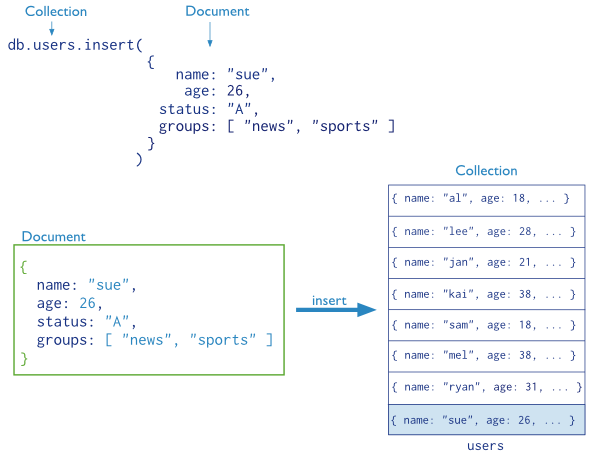

% NoSQL (MongoDB)
% Dr. Andrew Besmer

# Mongo Access

## Getting Access to Mongo

* Everyone will use the same server
	* infd.birdnest.org
	* Logon using Putty with campus user/password

* Accessing mongo
	* Create your database
		* `mongo YOURUSERNAME`
		* Create all your collections in this same db

# Terms

## RDBMS vs Document Oriented

* **collection**, **document**, and **properties** instead of table, row, and column
	* These are a rough mapping, relational DBMS is not the same as document
	* For example, properties can contain many objects, a column in RDBMS should contain an atomic value

\ 

| Doc Oriented |  RDBMS  |
| :--------------: | :----: |
|   Collection    | Table  |
|  Document       | Row    |
|  Property     | Column |

## Databases

* A database is essentially the same as MySQL databases
* Each database houses it's own files
* A database holds collections which will in turn hold documents

## Databases

* There are typically many databases on a mongo server 
* To specify which you want `use` a database
	* `use MyDatabaseName;`
	* **Note:** If the database doesn't exist, it will be created[^created] when you insert a document into a collection
* The `use` command assigns the specified database to a variable `db`
* Type `db` to see which you are using

[^created]: Provided you have sufficient permissions to do so 


## Collections

* Collections are similar to, but different from, MySQL tables
* Collections hold many documents (similar to rows), for example a `users` collection
* Working with collections should be done through the variable `db`

```javascript
//Assign the variable db to the university database
use university;

/* 
* Find all the documents in the 
* university databases collection 
* users 
*/
db.users.find() 
```

## Collections

* `db.users.find()` - Get all the documents in the users collection


## Documents

* Documents are like MySQL rows with some major exceptions
	* They are not usually normalized
	* They are schemaless
	* `_id` is **always** the primary key 
	* `_id` is **always** the first property [^pkidException] [^pkidException2]
* Schemaless design means no apriori rigid specification like MySQL

[^pkidException]: If you don't provide `_id` mongo will and also make it the first
[^pkidException2]: Mongo will reorder the `_id` if you don't put it first

## Document Schema

* The document schema is simply the properties on the object to be persisted
* The following schema contains properties for
	* `name` - Name of the person
	* `age` - Age of the person
	* `status` - Current grade
	* `groups` - List of groups the person belongs to

```javascript
{
  name: "Fred Duncan",                // <- field: value
  age: 22,                            // <- field: value
  status: "A",                        // <- field: value
  groups: [ "students", "employees" ] // <- field: value
}
```

## Document Schema

* Notice in the relational model `groups` would violate 1NF and be considered bad design

```javascript
{
  name: "Fred Duncan",                // <- field: value
  age: 22,                            // <- field: value
  status: "A",                        // <- field: value
  groups: [ "students", "employees" ] // <- field: value
}
```

## Document Schema

* Documents within the same collection can have as many different schemas as you can put documents!
	* Just because you can doesn't mean you should!
	* You can help, or hang yourself, with the flexibility.


```javascript
{
  name: {
    first: "Sue",
    last: "Person"
  },
  age: 28,
  categories: [ {name : "students"}, {name: "honors"} ]
}
```


## Document Schema

* Limited to max document size of 16M
* Property names can not start with `$` or `.`
* Take away is documents are very flexible in terms of schema so use wisely

# Creation

## Creating Databases

* Creating databases is as simple as using them with `use` and inserting some data in a collection[^created] 
* Database will not be created until there is data in it!
* Can `show dbs` to see which currently exist

## Creating Collections

* Much like creating database simply insert to create the collection
* `db.users.insert({name:"Sue Person"});` inserts a document **and** creates the collection if it doesn't exist
* Alternatively `db.createCollection()` can be used to create the collection without inserting data
* Use `show collections;` or `db.getCollectionNames();` to see a list

## Creating Collections

* `db.createCollection()` allows for custom collection creation
	* Check out the capped collection
	* `size` is bytes
	* `max` is n

```javascript 
db.createCollection(name, {
  capped: <boolean>, 
  autoIndexId: <boolean>, 
  size: <number>, 
  max: <number>
});
```

## Creating Documents


* Simply insert them using `db.collection.insert()`

```javascript
//Insert into the users collection
db.users.insert (
  {
    name: "Sue Person",
    age: 26,
    status: "A",
    groups: [ "students", "honors" ]
  }
)
```

## Anatomy of an Insert




## Data Types

* Document format is BSON (Binary Javascript Object Notation)
* Like JSON (Javascript Object Notation)
* Here are just a few examples of common BSON data types
	* `Double`, `String`, `Array`
	* `Binary`, `ObjectId`, `Boolean`
	* `Date`, `Integer`, and so on
* Most of these familiar already `ObjectId` however is interesting, lets take a look

## ObjectId

* `ObjectId` is set automatically by mongo if you don't provide `_id`
	* `ObjectId` made up of 12 bytes
	* 4 bytes - unix epoch
	* 3 bytes - server
	* 2 bytes - PID
	* 3 bytes - randomish number
* Free created at functionality!
* Why wouldn't mongo just use an auto incrementing id like mysql?

# Retrieval

## Basic Retrieval

* The most basic type of retrieval uses the `db.collection.find()`
* Go ahead and do a few inserts in your own database for the users collections use `db.users.find()` to see that they worked!

```javascript
db.users.insert({name:"Alice"});
db.users.insert({name:"Bob"});
db.users.insert({name:"Trudy"});

db.users.find();
```

## Selecting All
* Several methods for selection
	* `db.collection.find()`
	* `db.collection.aggregate()` 

```javascript
db.users.find();
db.users.aggregate();
```

## Criteria Selection

* It is possible to do criteria based selection

* Comparison operators:
	* `$gt` - Greater than
	* `$gte` - Greater than or equal to
	* `$lt` - Less than
	* `$lte` - Less than or equal to
	* `$ne` - Not equal to
* These all work conceptually the same way they do in MySQL or programming

## Example

* Lets insert some sample data we can do selection on

```javascript
//drop the collection
//insert some sample
db.students.remove({});

db.students.insert({
  name: "Alice",
  age: 16,              //Genius
  grades: [70, 98, 88, 95]	
});

db.students.insert({
  name: "Alice",
  age:  30,            //Not Genius
  grades: [27, 49, 52, 65]	
});

db.students.insert({
  name: "Bob",
  age: 34,
  grades: [67, 75, 73, 81]	
});

db.students.insert({
  name: "Trudy",
  age: 21,
  grades: [90, 98, 94, 100]	
});

db.students.insert({
  name: "Joe",
  age: 27,
  grades: [40, 77, 65, 80]	
});

db.students.insert({
  name: "Robson",
  age: 18,
  grades: [56, 82, 74, 68]	
});
```

## Criteria Selection
 
* Each of the operators is set as a property on an object that will be set as a value on the property you are testing
	* In other words they are set as an expression on the property in the form of an object
	* Wow!
* For example, to find all students above the age of 18

```javascript
db.students.find({
  age : {    //search age
    $gt: 18  // > 18
  }
});
```

## Anatomy of find


## Criteria Select

* Try to select
	* Students under 21
	* Students 21 or older

## Criteria Select

* Other criteria based operators
	* `$in` - Does any of the values in an array match?
	* `$nin` - Does any of the values in the array not match
* The following selects which students are either 18 or 21

```javascript
db.students.find({
  age : {
    $in: [18, 21]
  }
});
```

## Logical Selection

* Similar to SQL you can also do logical selection
	* `$or` - logical or
	* `$and` - logical and
	* `$not` - opposite
	* `$nor` - no match for both criteria
* The trick to using these operators is that they must be provided before specifying the field since they take an array of expressions

## Logical Selection

* Selects all the documents with students named "Joe" or who are 21 or older

```javascript
db.students.find({
  $or : [ //an array of expressions
    {
      name: "Joe"
    },
    {
      age: { $gte : 21 }
    }
  ]
});
```

## Practice

* Select students named "Alice" who are also under the age of 21

## Practice

* Select students named "Alice" who are also under the age of 21

```javascript
db.students.find({
  $and : [ //an array of expressions
    {
      name: "Alice"
    },
    {
      age: { $lt : 21 }
    }
  ]
});
```

or

```javascript
//So what does this tell you?
db.students.find({
    
      name: "Alice",
      age: { $lt : 21 }
});
```

## Misc Operators

* Other operators
	* `$mod` - Modulus
	* `$regex` - Regular expression
	* `$text` - Text search (requires index)
	* `$where` - Custom javascript expression
	* `$geoWithin`/`$geoIntersects` - Geolocation matching, i.e. everything within a radius!
	* and more...


## Array selection

* List students who have made an A or B

```javascript
// What is interesting about these results?
db.students.find({
  grades: { $gte : 80}
});
```

## Projection

* Our selections have resulted in the entire document being returned
* Much like MySQL projection can limit returned data
	* i.e. - `SELECT projection FROM table`
* Projection is the second object passed to `.find()`
	* Can either whitelist `1` **OR** blacklist `0`
	* Exception is for `_id`

## Projection

```javascript
db.students.find(
  {},         // Criteria, or all documents
  { 
    name : 1  // Projection, whitelist only the name
  });
```
or
```javascript
db.students.find(
  {},        // Criteria, or all documents
  { 
    age : 0  // Projection, blacklist age
  });
```

\ 

* **Note** that turning `_id` on or off has no effect on whitelisting vs blacklisting

## Practice time

* Create three more students with the properties:
	* name
	* dorm
		* name
		* roomNumber
	* classes **an array of objects containing**
		* name
		* days **an array containing**
			* Days the class meets
		* credits


## Example

```javascript
{
  name: "Alice",
  dorm: {
    name: "Thurmond",
    room: "304"
  },
  classes: [
    { name: "Databases", days: ["Monday", "Wednesday"], credits: 3 },
    { name: "Advanced Databases", days: ["Tuesday", "Thursday"] , credits: 3 },
  ]
}
```

## Questions to Ask

* Find students with classes that meeting on Thursday
* Find students taking classes with 2 credits or more
* and so on...


# Modification

## Update

* To update use `db.collection.update()`
* The `.update()` usually takes at least two parameters
	* The selection criteria indicating which documents to update
	* The update object
* **Note** that the update object will _replace_ the matched document unless you use special operators! 
	* It will not overwrite `_id` though

```javascript
db.students.insert({_id: 12345, name: "Gary", age: 44});

db.students.update({_id:12345}, {age:45});

db.students.find({_id:12345});
// { "_id" : 12345, "age" : 45 }
```

## Update Operators

* These field operators do not replace the entire document
	* `$inc` - Increment (positive or negative) the field by the value
	* `$mul` - Multiply the field by the value
	* `$rename` - Rename the field
	* `$set` - Set the field to the value
	* `$unset` - Unset the field entirely (removal)
	* `$min` - Set the min of existing or new value
	* `$max` - Set the max of existing or new value
	* `$currentDate` Set the current date/time


## Update Example

```javascript
db.students.remove({_id:12345}); //remove old 

db.students.insert({_id: 12345, name: "Gary", age: 44});

db.students.update(
  { _id : 12345 }, //what doc to update
  { $set : 
    { 
      age : 45 //set the age to 45
    }
  }
);

db.students.find({_id:12345});
// { "_id" : 12345, "name" : "Gary", "age" : 45 }
```

## Update

* Lets advance the age of all our students by one year
	* What went wrong?


## Update

* By default the update command updates just a single document
	* Need to tell mongo you want to update `multi`ple documents
	* This is the options object (third) passed to update
		* Other options are `upsert` and `writeConcern`
		* More on these later

```javascript
 db.students.update(
  {},                  //Match all documents
  { $inc: {age:1} },   //Increment the age by one
  { multi:true }       //Update more than 1 document
);
```

## Update Array Operator

* Different operators available for arrays
	* `$` - Symbolizes the first element in the array to match query conditions
	* `$addToSet` - Add element to array but only if it doesn't already exist
	* `$pop` - Remove first (`-1`) or last (`1`) element in the array
	* `$pullAll` - Remove all matching provided elements in the array
	* `$pull` - Removes all elements from the array matching search criteria
	* `$push` - Adds element to the end of the array

## Update operations

* Add the grade of 100 to the student named "Robson"

```javascript
db.students.update(
  {name: "Robson"},        //What to update
  {
    $push : {grades: 100}  //Push a 100 to grades array
  }
);
```

## Anatomy of update


## Update

* Other operators are available and can be found in the [documentation](http://docs.mongodb.org/)


# Removal


## Removing Documents

* To remove documents use `db.collection.remove()`
* Removing documents does not reclaim space
* Because mongo is document oriented there will not be any violations of referential integrity

## Removing Documents

* `.remove()` takes a query object that works exactly like all previous examples
* Be careful removing documents
	* Unlike `.update()` doing a `.remove()` does not work on one document by default
	* It can still be limited but default is limitless
	* The following removes all student documents

```javascript
db.students.remove({}); //Dang!
```


## Removing Collections

* You can remove an entire collection by dropping it
	* All documents within it will also be removed
	* There is no "are you sure" feature

```javascript
db.students.drop();
```


## Removing Databases

* To remove a database use `.dropDatabase()`

```javascript
db.dropDatabase();
```


# Practice

## Example Products

* Copy code from next slide into a `products.js` file
* Open ssh (Putty) connection to infd.birdnest.org
	* `mongo YOURUSERNAME < products.js`

## Example Products

```javascript
db.product.drop();

db.product.insert({
  name: "Batman Lego Set",
  qty: 1,
  price: 9.99,
  company: "LEGO",
  category: "Toys"
});

db.product.insert({
  name: "32 Piece Ratchet Set",
  qty: 2,
  price: 29.99,
  company: "Stanley",
  category: "Tools"
});

db.product.insert({
  name: "Hammer",
  qty: 5,
  price: 5.99,
  company: "Stanley",
  category: "Tools"
});

db.product.insert({
  name: "Toothpaste",
  qty: 1,
  price: 2.99,
  company: "Crest",
  category: "Health"
});

db.product.insert({
  name: "Floss",
  qty: 0,
  price: .99,
  company: "Crest",
  category: "Health"
});

db.product.insert({
  name: "Power Drill",
  qty: 5,
  price: 49.99,
  category: "Tools"
});

db.product.insert({
  name: "120 Piece Lego Set",
  qty: 1,
  price: 12.99,
  company: "LEGO"
});

db.product.insert({
  name: "Hot-wheels Car",
  qty: 10,
  price: .99
});
```

## Practice (1 of 2)

1. Create a view showing the values of the product on hand.
	* No option to do this with find.  Must aggregate. 

<!---
db.product.aggregate([{$project:{ prodvalue : {$multiply: ["$qty", "$price"]}}}]);
--->

2. Select all the products and the category that the product is in.
	* How many collections needed to be joined to recover the data?
	* How many in MySQL?
	* What sort of redundancy is present in either?
<!--
   db.products.find();
-->

3. Select the *product name* and the *category name* of all the products.


<!--
  db.products.find({}, {name: 1, category: 1});
-->

## Practice (2 of 2)

4. Select all the products, the categories they belong to, and the company the product is made by. 
	* How much easier is this query compared to MySQL?
	* What cost does this easy query come with?


4.1. Update the company "Stanley" to "Stanley Black and Decker" and re-run
	* How many documents needed to be updated?  
	* How many rows would MySQL have required?

5. Select all the products in the tools category with a price greater than 10.00.
	* Now only those made by Stanley Black and Decker.

6. Delete the matchbox company.
	* Any problems?


<!-- NOTE: REVISIT THESE SAME QUESTIONS IN ADVANCED SQL WITH INDEXING AND .EXPLAIN() -->

