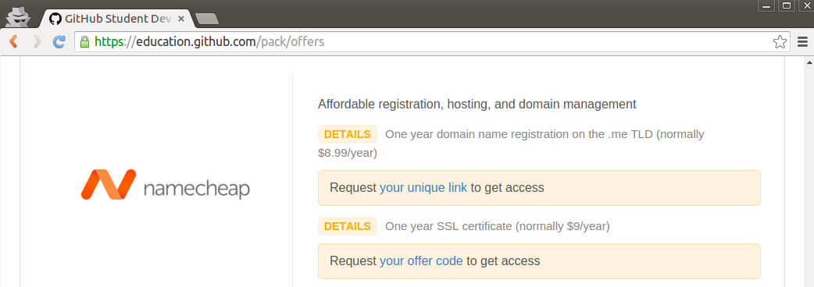

% Namecheap
% Dr. Andrew Besmer

# Namecheap

## Guide

* In the following slides you will be creating your free .me domain name

## Guide

1. Sign into [GitHub](http://www.github.com)
2. Goto [GitHub Offers](https://education.github.com/pack/offers)
3. Click on `Request your unique link` for the namecheap offer

## Guide

4. You will be brought to namecheap
5. Search for and find your domain you want
	* Must be a .me
6. `ADD` the `FREE` domain to your cart

## Guide

7. Click `Complete Order`
8. On the complete order page 
	* Keep `About.me Premium Setup` checked 
	* Keep `Free email hosting` checked
	* Enter your student email (`.edu`) 
	* Click `Finish Up`

\ 

* Example on next slide

## Guide

## Guide

9. You will be brought to a confirmation page
	* It will request you check your email
	* Check your email and click on the `Verify Your Email` link
10. You will be asked to create an account or login to an existing one
	* Fill out the namecheap registration form or sign in

## Guide

11. You will be brought to another confirm order screen 
12. Click `Finish Up`
13. You will receive a confirmation page and a confirmation email
	* Optional:
		* Sign up for your about.me account 
		* Don't sign up for an about.me account\ 

## Guide

14. Goto [namecheap](http://www.namecheap.com) and sign in with your newly created account to see your domain
	* You will find your domain under the option `Domain List` on the left hand side
