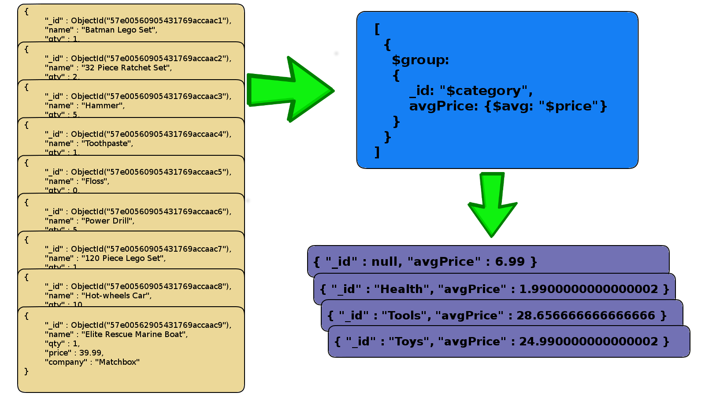

% Advanced NoSQL
% Aggregate Pipeline
% Dr. Andrew Besmer

# Aggregation Framework

## What is the Aggregation Framework?


## Why Aggregation is Needed

* Document structure may not fit application
* Aggregation framework helps reshape documents / collections
	* Averages
	* Summation
	* Grouping
	* Reshaping

## Aggregation Framework

* Executes in native code
	* written in c++
	* uses JSON parameters


# Aggregation Pipeline

## What is an Aggregation Pipeline?

* A series of document transformation
	* Executed in stages
	* Each stage uses output from last stage as input
	* Final output as document, cursor or collection 


## Aggregation Pipeline Example 


## Pipeline Operators

* $match - filters documents
* $project - reshapes documents
* $group - aggregates property data
* $unwind - expand properties to documents
* $sort - order documents
* $limit / $skip - pagenate documents
* $geoNear - proximity filter

# Filtering

## Our Example Data
```javascript
db.product.drop();

db.product.insert({
  name: "Batman Lego Set",
  qty: 1,
  price: 9.99,
  company: "LEGO",
  category: "Toys"
});

db.product.insert({
  name: "32 Piece Ratchet Set",
  qty: 2,
  price: 29.99,
  company: "Stanley",
  category: "Tools",
  vendors: ["Home Depot", "Lowes"]
});

db.product.insert({
  name: "Hammer",
  qty: 5,
  price: 5.99,
  company: "Stanley",
  category: "Tools",
  vendors: ["Lowes", "Ace"]
});

db.product.insert({
  name: "Toothpaste",
  qty: 1,
  price: 2.99,
  company: "Crest",
  category: "Health",
  vendors: ["Walmart", "Walgreens"]
});

db.product.insert({
  name: "Floss",
  qty: 0,
  price: .99,
  company: "Crest",
  category: "Health",
  vendors: ["Publix"]
});

db.product.insert({
  name: "Power Drill",
  qty: 5,
  price: 49.99,
  category: "Tools",
  vendors: ["Lowes", "Ace"]
});

db.product.insert({
  name: "120 Piece Lego Set",
  qty: 1,
  price: 12.99,
  company: "LEGO",
  vendors: ["Freds", "Walmart"]
});

db.product.insert({
  name: "Hot-wheels Car",
  qty: 10,
  price: .99
});

db.product.insert({
  name: "Elite Rescue Marine Boat",
  qty: 1,
  price: 39.99,
  category: "Toys",
  company: "Matchbox",
  vendors: ["Belk", "Toys R Us", "Kmart"]
});
```
## A Few Neat Things Before...

* Shell has many methods
	* `db.collection.find();`
	* `db.collection.aggregate([]);`
	* lots more in [documentation](https://docs.mongodb.com/master/reference/method/#collection)
* Also cursor methods
	* `.next()` - moves to the next document
	* `.pretty()` - gives pretty JSON output
	* `.forEach(jsfunction)` - moves cursor through results and runs jsfunction on each
	* lots more in [documentation](https://docs.mongodb.com/master/reference/method/#cursor)

## $match

* Filters documents
	* same syntax as `db.collection.find({});`
* Try it out
	* use aggregate to find all products in the "Toys" category

## Results

<div style="position:relative; width:960px; height:540px; margin:0 auto; padding-top: 20px">
 <div class="fragment fade-out" data-fragment-index="0">
```javascript
db.product.aggregate([
	{
		$match: {category: "Toys"}
	}
]).pretty();
```
 </div>
 
</div>

## $match with Query Operators

* Find some cheap products
```javascript
db.product.aggregate([
        {
          $match: {
                    price: {$lt: 1.00}
                  }
        }
]).pretty();
```
* You try
	* Find the products that are out of stock

## Results

<div style="position:relative; width:960px; height:540px; margin:0 auto; padding-top: 20px">
 <div class="fragment fade-out" data-fragment-index="0">
```javascript
   db.product.aggregate([			
    {
	   $match: {
	    qty: {$lt: 1}
	   }
    }   
   ]).pretty();
```
 </div>
 
</div>

# Projection

## Projection Explained

* Used to reshape documents
	* Include, exclude or rename fields
	* Inject computed fields
	* Create sub-document fields

## $project

* Very similar to project argument for find
	* exception is there is only exclusion for `_id`
* You try now
	* project only the `name`, `company` and `category` fields
	* exclude `_id`

## $project to Include / Exclude Fields

<div style="position:relative; width:960px; height:540px; margin:0 auto; padding-top: 20px">
 <div class="fragment fade-out" data-fragment-index="0">

```javascript
db.product.aggregate([
	{
		$project: {
			_id: 0, 
			name: 1,
			company: 1,
			category: 1
		}
	}
]).pretty();
```

 </div>
 
</div>

## $project to Rename / Compute Fields

* Use operators to rename or compute fields
* Some $project operators are:
	* $add, $subtract, $divide, $multiply
	* $ceil, $floor, $abs, $log, $sqrt
	* $concat, $toLower, $substr
	* many, many more

## $project to Rename / Compute Fields

* Add the company and name together             
* exclude `_id`

```javascript
db.product.aggregate([
	{
		$project: {
			_id: 0, 
			FullName: {
				$concat: ["$company", " ", "$name"]
			}
		}
	}
]).pretty();
```

* Nice! Now we can do number 1 from previous lecture
	* Create a view showing the values of the product on hand

## $project to Rename / Compute Fields

<div style="position:relative; width:960px; height:540px; margin:0 auto; padding-top: 20px">
 <div class="fragment fade-out" data-fragment-index="0">

```javascript
db.product.aggregate([
	{
		$project:	{
				_id: 0, 
				name: 1,
				onhand: 
					{
						$multiply: ["$qty", "$price"]
					}
		}
	}, 
	{
		$match:	{
				onhand: {$gt: 0}
		}
	}
]).pretty();
```

 </div>
 
</div>

## $project to Create Sub-Document Fields

* Using $project to reshape the document

```javascript
db.product.aggregate([
	{
		$project: {
			name: 1, 
			inventory: {qty: "$qty", price: "$price"}
		}
	}
]).pretty();
```

* Single result example

```JSON
{
        "_id" : ObjectId("57e008fa905431769accaaca"),
        "name" : "Batman Lego Set",
        "inventory" : {
                "qty" : 1,
                "price" : 9.99
        }
}
```

# Grouping

## $group

* Allows use of *real* aggregate functions
* Groups documents by value
	* Field reference, object, constant for grouping value
	* All other fields are computed with a function
		* `$max`, `$min`, `$avg`, `$sum`
		* `$addToSet`, `$push`
		* `$first`, `$last`

## $group

* Syntax same as other pipeline operators
`{$group: {_id: $group, prop: {$avg: "$prop"}, ... }}`
* `_id` is used as the grouping property
	* can be multiple properties
	* use `_id: null` to group all documents
* Other aggregated properties are named and assigned operators
* You try now...
	* Show average price of products by category

## $group

<div style="position:relative; width:960px; height:540px; margin:0 auto; padding-top: 20px">
 <div class="fragment fade-out" data-fragment-index="0">

```javascript
db.product.aggregate([
	{
		$group:	
		{
			_id: "$category", 
			avgPrice: {$avg: "$price"}
		}
	}
]).pretty(); 
```

 </div>
 
</div>

## Summing and Counting

* `$sum` same as `$avg` to sum field values
* Use `$sum: 1` to count documents
* Show the sum of all product quantities and number of products by company

## Summing and Counting

<div style="position:relative; width:960px; height:540px; margin:0 auto; padding-top: 20px">
 <div class="fragment fade-out" data-fragment-index="0">

```javascript
db.product.aggregate([
	{
		$group:	
		{
			_id: "$company", 
			totQty: {$sum: "$qty"},
			countProducts: {$sum: 1}
		}
	}
]).pretty(); 
```

 </div>
 
</div>

## $addToSet - Collecting Distinct Values

* Which products are made by each company?


# Deconstruct Arrays

## $unwind

* Operate on array fields
* Creates new documents from array elements
	* i.e. ["a", "b", "c", "d", "e"] would create 5 new documents
	* Array is replaced by single element value
	* Missing/empty fields -> no output
	* Non-array fields -> (v2.6) error, (v3.2) treats as single item array
* Can be piped to `$group` to aggregate

## $unwind


## $unwind

* **You try**: Use unwind to help you get the average price of all the products sold by each vendor.

## $unwind

```javascript
db.product.aggregate([
	{ $unwind: "$vendors"},
	{         $group:
			{
		             _id: "$vendors",
		             avgPrice: {$avg: "$price"}
		        }
	} 
]).pretty();

```

# Sorting and Pagination

## $sort

* Sort documents by one or more fields
	* `{$sort: {field: 1}}  // ascending order`
	* `{$sort: {field: -1}} // descending order`
* Waits for previous pipeline operator to finish and return
	* Makes sense for sorting
* Works in memory if not based on an index

## $sort Example


## Pagination

* `$limit` - Limits the result set
	* Useful for pagination
	* Also useful for testing large data sets
* `$skip` - Skips through document results
	* Useful for pagination
	* ex. 3rd page of 5 docs / page 
	* `{$skip: 10},{$limit: 5}`

## $limit Example


## $skip Example


# Geospatial Operator

## $geoNear

* Orders or filters documents by locations
	* Requires a geospatial index
	* Output will include the physical distance for each document
	* Must be the first aggregation stage

## Query by Location Proximity

<div style="position:relative; width:960px; height:540px; margin:0 auto; padding-top: 20px">
 <div class="fragment fade-out" data-fragment-index="0">

```javascript
// sample zipcode collection
// example document
{
	"_id" : 10021,
	"city" : “NEW YORK”,
	"loc" : [	
		-73.958805,
		40.768476
	],
	"pop" : 106564,
	"state" : ”NY”
}
```

 </div>
 
</div>


