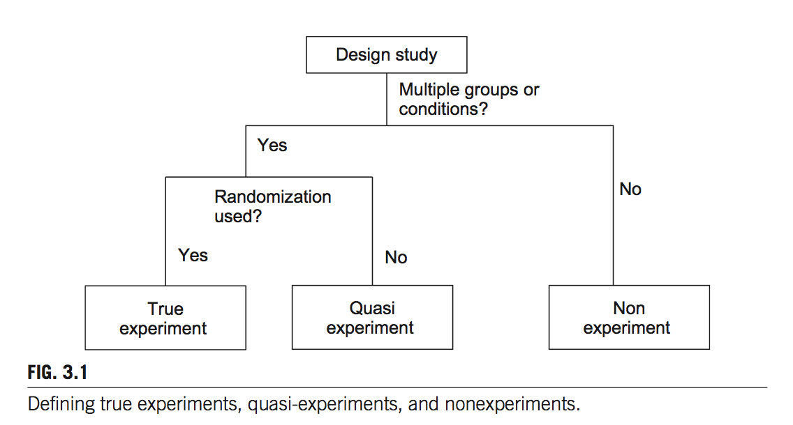
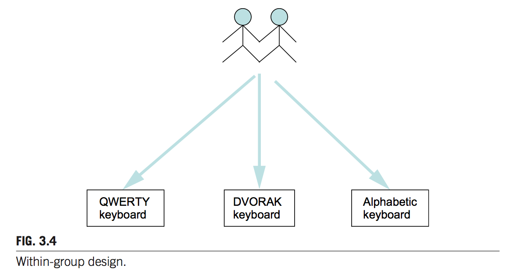
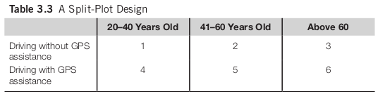

% Experimental Design
% Chapter 3
% Dr. Andrew Besmer

# Experimental Design

## Studies

{width=70%}

## True Experiments

* Based on a hypothesis
* Have conditions to be tested
* One or more dependent variables can be measured
* Uses statistical tests
* Systematically removes or controls biases
* Can be replicated

## Considerations

* Research hypothesis 
    * Clearly defined 
    * Appropriate scope
* Dependent variables
    * Easy to measure
* Independent variables and controls
    * Easy to control

## Basic Structure

* How many IVs do we want to have?
* How many values for each IV?
* Lets look at one IV

## Basic Structure

{width=70%}

## One IV

* What are the IVs? How many conditions?
    * **H1:** *There is no difference in typing speed when using a QWERTY keyboard, a DVORAK keyboard, or an alphabetically ordered keyboard.*
    * **H2:** *There is no difference in the time required to locate an item in an online store between novice users and experienced users.*

## One IV

* What are the IVs? How many conditions?
    * **H3:** *There is no difference in the perceived trust toward an online agent among customers who are from the United States, Russia, China, and Nigeria.*
* Now we can chose design

## Between Groups Design

* Between Groups/Subjects Design
    * One participant goes to one condition
        * Random assignment when can, if assigning, counterbalance 
    * So how many groups will we have?

## Between Groups Design

* Advantages
    * Better control
    * Generally requires less time per participant
    * Fatigue, Frustration issues avoided
* Disadvantages
    * May be individual differences
        * Type II error more likely
        * Higher $n$ and random sample dilute
    * Requires a larger sample size
* How many participants would you need?

## Between Groups Design

{width=70%}

## Within Groups Design

* Within Groups/Subjects Design 
    * One participant gets multiple treatment conditions
    * So how many groups will we have?
    * How many participants needed?

## Within Groups Design

* Advantages
    * Smaller sample sizes
    * Difference between conditions more detectible (less "noise")
    * Less expensive if providing inducement
* Disadvantages
    * Learning effects 
        * Consider Latin Square Design to attempt to mitigate
    * Participants must spend longer time increasing fatigue, frustration

## Within Groups Design

{width=70%}

## When To Use

* Choosing is hard, disagreements happen
* Use between group when you have
    * Simple tasks
    * Potential for large learning effects
    * Within-group is not feasible
* Use within groups when you have
    * Small participant pools
    * No or small learning effects (Fonts and reading speed)
    * Substantial cognitive/perceptual capabilities

## Practice

* For **H1**, **H2**, **H3** choose which design you would use?

# Factorial Design

## Factorial Design

* Allows for multiple IVs with different *levels*
* Number of conditions defined as 

$C = {\displaystyle \prod_{a=1}^{n} V_a}$

* $C$ - Number of conditions
* $a$ - Each IV $\{1, 2, ..., n\}$
* $V_a$ - Number of levels in IV $a$
* $\prod$ - Product operator

## More Than One IV

* What are the IVs? Levels? How many conditions?
    * **H4:** *There is no difference between the target selection speed when using a mouse, a joystick, or a trackball to select icons of different sizes (small, medium and large).*
* How many total conditions are there?

## Factorial Designs

* Three Options
    * Between Groups
    * Within Groups
    * Split-plot (Has both of former components)
    
## Split-plot

* One or more IVs chosen as between groups and rest assigned to within
* Consider looking at driving time with age (between) and gps use (within) as the IVs in a split plot 

## Interaction Effects

* Allows study of IV's as well as potential interaction effects
    * *Interaction Effect* - The differing effect of one independent variable on the dependent variable, depending on the particular level of another independent variable
    * "When a significant interaction exists between independent variables X and Y, the means of the dependent variable Z would be determined jointly by X and Y."

## Interaction Effect

{width=70%}

# Replication

## Random Errors

* HCI vs Physics studies have higher variations and thus lower ability to reproduce due to random error
* Can be described as
$Observed Value = Actual Value + Random Error$
* Random error pushes actual value up/down and can not be directly controlled for
* Higher $n$ can bring resulting observed values closer to actual as highs and lows offset each other

## Systematic Error

* The result of "biases"
* Always push actual values in the same direction resulting in biased observed values
* Can NEVER be offset by increasing sample size
* Reduce reliability of research 
* Should be eliminated 

## Systematic Error

* Typical sources
    * Measurement instruments
    * Participants
    * Experimenter behavior
    * Environmental
    * Experimental procedures 

## Measurement instruments

* Stopwatch operated by human vs instrumentation
* Accuracy of measurements themselves
    * Pressure sensitive keyboard

## Participants

* Participant representation of target demographic
* Recruitment sources
* Put at ease, you are testing X, not them!
* Reschedule if participant is tired, stressed, etc...

## Experimenter Behavior

* Intentional 
    * Unethical
    * Hurts all of research

## Experimenter Behavior

* Unintentional influence
    * Facial expression, body language
        * Altering perception
    * "Now try X I designed it myself."
        * Unlikely to share negative subjective data

## Experimenter Behavior

* Unintentional influence
    * Loading website: "Wow this is loading slowly"
        * Negatively priming 
    * Tapping fingers
        * Increasing participant stress

## Experimenter Behavior

* Unintentional influence
    * Late and missing task list
        * Investigator is not taking serious
        * Participant may not either

## Experimenter Behavior

* Train in being calm, neutral, and patient
* Have multiple investigators, one primary running it, second observing taking notes of issues
* Use written documents and detailed procedures including speech
* Record important instructions and play them for participants

## Environmental

* Physical
    * Noise
    * Temperature
    * Lighting
    * Vibration
    * Humidity

## Environmental

* Physical
    * Usually aim for clean, quiet, well lit environment in a lab setting
    * When possible use one way mirror for observation

## Environmental

* Social
    * Number of people present
    * Relationship to people
    * Presence of investigator, e.g. watching over shoulder

## Experimental Procedures

* Effects Identified and Mitigated
    * Learning effects
    * Frustration 
* Instructions 
    * Should be scrutinized 
        * "complete as quickly as possible"
        * "take your time, there is no rush"
    * Should be consistent
        * Multiple investigators
        * Use scripted if possible

## Experimental Procedures

* Pilots
    * Run practice study for purposes of uncovering issues
    * Helps identify issues before data collection
* Pilots are absolutely needed to identify issues and biases
    * These are not a luxury

## Replication

# Misc

## Controlling Learning Effect

* Consider providing opportunity for learning 
    * Learning curve is typically steep

## Study Time

* Maximum time should be 60-90 minutes
    * Participants become tired, frustrated
    * Performance is typically impacted
* Over 2 hours generally considered a bad idea
* Provide for breaks
    * Suggesting, even encouraging them, may not be enough

## Controlling IVs 

* Controlling IVs sometimes very hard
* Consider 
    * Study of speech recognition system in understanding the impact of recognition errors on user behavior.
    * Control condition have no recognition errors?!?

## Controlling IVs 

* Possible solution is *Wizard of Oz* study
    * Human typist listens to audio and transcribes
    * Not revealed until later in the study
    * Able to study conditions not easily studied in real world
    * Still possible human introduces errors in the control

# Running Experiments

## Lifecycle

1. Identify a research hypothesis
2. Specify the design of the study
3. Run a pilot study to test the design, the system, and the study instruments
4. Recruit participants
5. Run the actual data collection sessions
6. Analyze the data
7. Report the results

## Typical Session

1. Preparation
2. Greet participants
3. Introduce the purpose of the study and the procedures
4. Get consent
5. Assign participants to a specific experiment condition 

## Typical Session

6. Training task(s)
7. Actual task(s)
8. Participants answer questionnaires (if any)
9. Debriefing session
10. Payment (if any)

# Questions

## Questions

* Questions?
