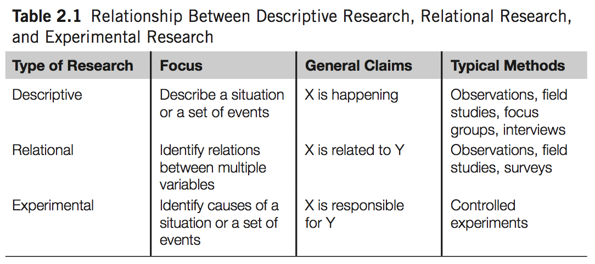
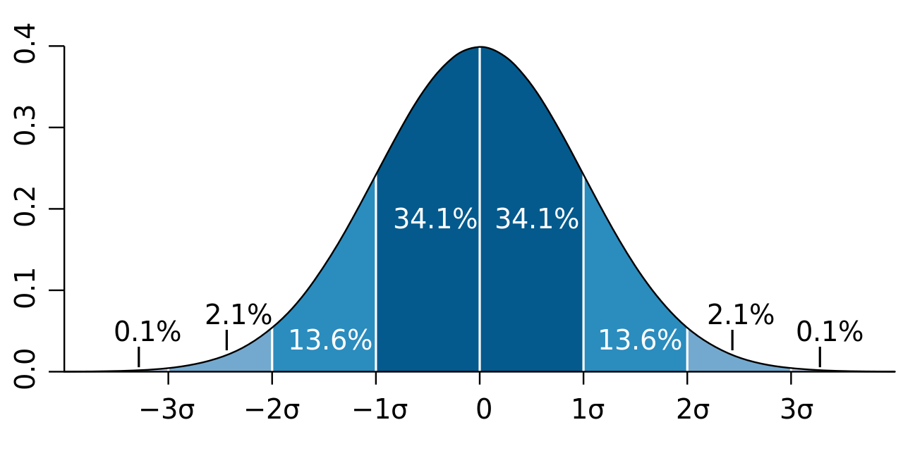
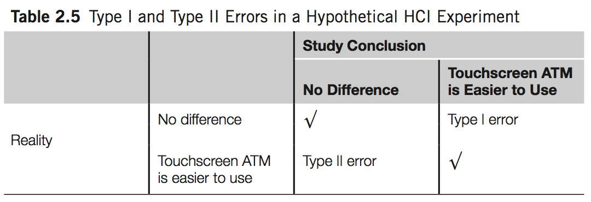

% Experimental Research
% Chapter 2
% Dr. Andrew Besmer

# Experimental Research

## Catagories

* Three broad categories
	* **Descriptive**
		* E.g. Observations, focus groups
		* Consider 8/10 who can play game and type fast
		* Interesting phenomena but not relationship

## Catagories

* Three broad categories
	* **Relational**
		* E.g. Correlation Analysis
		* Consider hours played and words per minute
		* Relationship but not causality

## Catagories

* Three broad categories
	* **Experimental**
		* E.g. Treatment Study
		* Consider a control and treatment
		* Causality can be established
* Types of studies are not totally independent

## Catagories

## Getting Started

* Start with a research hypothesis 
	* Study built around this
	* Basis for statistical tests
* Theory vs Hypothesis
	* Theory: *Fitts Law* - Time increases as distance increases and target size decreases in movement tasks.
	* Hypothesis: Mouse, Touch, etc...

## Hypothesis 

* Null ($H_0$) vs Alternative ($H_1$) Hypothesis
	* Null hypothesis states that there is no difference between experimental treatments
	* Alternative hypothesis is mutually exclusive the null
* Some experiments have several

## Hypothesis

* Experiment to determine which menu design allows users to navigate a site more effectively
	* $H_0$: There is no difference between pull down and pop up menus in time spent locating pages.
	* $H_1$: There is a difference between the pull down and pop up menus in time spent locating pages.
* Statistical test will tell us whether it is reasonable to reject the null hypothesis and the likelihood of being wrong

## Testing Hypothesis

* You can test multiple hypothesis
* No limit but...
	* More factors to control for
	* Increased possibility of flaw

## A Good Hypothesis

* A good hypothesis generally:
	* Is presented in clear, precise language
	* Is focused on a problem that is testable in a single experiment
	* Clearly states the control group or conditions of the experiment

## Variables

* Different Types of Variables
	* **Independent** - What we are studying, changing, or might cause a change
		* Think treatments or conditions that researcher controls
		* E.g. Menu type

## Variables

* Different Types of Variables
	* **Dependant** - The variables being measured that is dependent on participants behavior or change in the independent variable
		* Think outcomes
		* E.g. Time locating page
		* Some faster than others, more experienced, ...

## Independent Variables

* Typical Independent Variables
	* Devices
	* Modalities
	* Designs
	* User characteristics 
		* Age, experience, mood, profession

## Dependent Variables

* Dependent Variables usually one of 5 groups
	* Efficiency 
	* Accuracy
	* Subjective Satisfaction
	* Learning/Retention
	* Physical/Cognitive Demand
* Efficiency and Accuracy are usually, but not always, related

## Controlling Factors

* Experimental Research allows for controlling of factors
	* Randomized design
	* No one, including investigator, can predict which treatment group is used
	* Controls for intentional or subconscious influence of hidden factors

## Controlling Factors

* Randomization measures
	* Tossing a coin
	* Throwing dice
	* Software, etc...
* Uniform Distribution Example - [Histogram](https://www.socscistatistics.com/descriptive/histograms/) & [Random Data](https://www.random.org/integers/)

## Design Types

* Consider comparing QWERTY to DVORAK
	* Need participants that have used neither or highly biased
	* **Between-Subjects Design**
		* Assign randomly to each group and measure
	* **Within-Subjects Design**
		* All participants use both and are measured
	* **Mixed Factorial**
		* Combination of both

## Counterbalancing 

* Measuring participant more than once?
	* Each participant does Task A, Task B, Task C
	* Several problems
		* Carryover effect
		* Fatigue effect
		* Context effect

## Counterbalancing 

* Measuring participant more than once?
	* Should counterbalance assigning order randomly
		* Consider using Latin Squares - ABC, ACB, BAC, BCA, CAB, CBA
		* Mitigates confounding ordering effects
		* Potentially allows for studying the problem ones, e.g. carryover

## Significance Testing

* Nearly all experimental investigations use statistical significance testing
* Consider two statements:
	* Mike's height is 6′2″. Mary's height is 5′8″. So Mike is taller than Mary.
	* The average height of three males (Mike, John, and Ted) is 5′5″. The average height of three females (Mary, Rose, and Jessica) is 5′10″. So females are taller than males.
* Population vs Sample

## Normal Distribution 

## Significance Testing

* Use statistical test to help us be confident the result applies to the entire population
* For example, t-test with $p < .05$ would indicate we are 95% certain the result applies to the general population
	* [t-test calculator](https://www.graphpad.com/quickcalcs/ttest1.cfm)

## Type I & II Errors

* Allows us to contrast $H_0$ and $H_1$ to determine the likelihood the null hypothesis ($H_0$) is true
* All significance testing is subject to Type I and Type II error
	* **Type I** - "false positive" or rejecting the null hypothesis when it should not be
	* **Type II** - "false negative" or accepting the null hypothesis when it should be rejected

## Type I & II Errors

* Consider a court case where we presume the defendant is innocent
	* $H_0$: The defendant is innocent
	* $H_1$: The defendant is guilty
	* Both errors have very real costs

## Type I & II Errors

## Try It

* Consider a bank that wants to understand if ATMs with a touch screen are easier to use than ATMs with buttons
* In groups:
	* Identify the $H_0$ and $H_1$
		* Identify **Type I** and **II** Errors

## Try It

* Answer: 
	* $H_0$: There is no difference between the ease of use of ATMs with touch screens
and ATMs with buttons.
	* $H_1$: ATMs with touch screens are easier to use than ATMs with buttons.

## Try It

## Type I & II Errors

* Generally believed that Type I errors are worse than Type II
	* Type I is a mistake that involves "gullibility" and potentially results in a worse current state
	* Type II involves "blindness" and potentially loses ability to improve current state
* Consider medication study involving Type I and II errors

## Type I & II Errors

* Type I is called **alpha** or **significance level** or **p value**
* Type II is called **beta** 
* Alpha and beta are related, becoming less gullible means increased blindness
* $p=.05$ is widely used

## Hawthorne Effect

* Consider limitations e.g. "Hawthorne effect"
	* Short term improvements not lasting after observation
	* Incentive, stress, environment and so on

## Experiments

* Experimental approaches are effective ways to generalize to larger populations
* Must be successfully designed and carried
* Must deal with potentially confounding variables
	* Random + increased sample size
	* Explicitly control for
	* Use as covariable

## Questions

* Questions?
