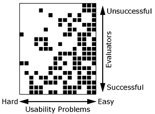
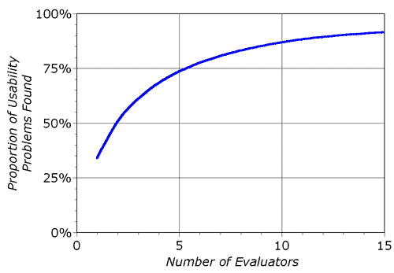
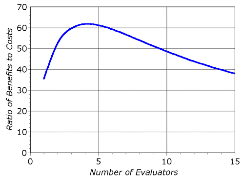

% Heuristic Evaluation
%
% Dr. Andrew Besmer

# Heuristic Evaluation

## Heuristic Evaluation

* [Heuristic Evaluation](https://www.nngroup.com/articles/how-to-conduct-a-heuristic-evaluation/) is a discount usability technique
    * Developed by Jakob Neilsen
    * Find problems in a user interface design
    * Small set of evaluators evaluate based on usability principles ("heuristics")
* One case study showed cost benefit ratio of 1:48!

## Finding Problems

* Hard for a single evaluator to find all
* 19 evaluators find 16 problems in voice response system for bank
* Easy problems found by many evaluators
* Hard problems identified by those not finding many

## Evaluators 

## Evaluators

* Nielsen recommends 3-5 because of diminishing returns

{width=35%}

## Evaluators

## Performing

* Evaluator inspects interface alone 
* Communication only when finished to aggregate
* In user study, typically want users to answer questions through exploration
* In HE, evaluator questions may be answered
    * May not be domain experts
    * Evaluator time valuable
    * Generally not given hints unless they ask or are clearly in need

## Performing

* Typical HE lasts 1-2 hours
    * If longer needed, consider splitting into multiple sessions
* Evaluator goes through several times comparing interface to the heuristics

## Reporting

* Reported with:
    * Written report by each evaluator
        * Formal record
        * Read/aggregated by an evaluation manager
    * Verbalization to an observer
        * Increase overhead reduced evaluator burden
        * Potentially faster results as no report by each

## Output

* Output is list of usability problems 
    * Reference those heuristics which were violated
    * Can not just say you do not like
    * Be specific and list each separately
        * Risk reintroducing the problem when another is solved
        * May not be possible to fix that specific one but related ones might be fixable

## Debrief

* Sometimes might be worth debriefing
    * What went well is not covered
    * Discussion of possible design solutions

# Heuristics

## Heuristics

* Neilsen/Norman Group provides 10 well known [usability heuristics](https://www.nngroup.com/articles/ten-usability-heuristics/)

## Visibility of System Status

* Users should understand current system status
* Facilitates learning outcomes of prior interactions to determine next steps
* Tips
    * Communicate clearly system state
    * Present feedback quickly, ideally immediately
    * Build trust through continuous communication

## Match System & Real World

* Design should "speak" users language
    * Words, concepts, phrases 
    * No internal jargon
* Use natural mapping when possible
* Tips
    * Users don't need to look up definitions
    * Don't assume your understanding = users
    * Perform user research to understand mental models, familiar terminology

## Match System & Real World

{width=40%}

## User control and freedom

* Users make mistakes, provide clearly marked "emergency exit"
* Allows users to feel like they remain in control of system, reduces frustration
* Tips
    * Support *Undo* and *Redo*
    * Show a clear way to exit, e.g. *Cancel* button
    * Exit clearly labeled and discoverable

## Consistency & Standards

* Users shouldn't have to wonder whether different words, situations, actions mean same thing
* Follow platform and industry conventions
* People spend most of their time using systems *other than yours*
* Failing to do so increases cognitive burden
* Tips
    * Consider internal and external consistency
    * Follow established conventions

## Error Prevention

* Good error messages important but preventing errors is better
* Eliminate error prone conditions or check for them 
    * *Slips* - Unconscious errors
    * *Mistakes* - Conscious errors based on mismatch between mental model and design

## Error Prevention

* Tips
    * Prioritize high-cost errors first, then frustrations
    * Avoid slips by providing helpful constraints and good defaults
    * Prevent mistakes by reducing or removing memory burdens, warning users, providing undo

## Recognition Over Recall

* Minimize user memory load
    * Actions, elements, options visible
    * Avoid memory carryover from one part of interface to another
    * Information required to use design visible (e.g. labels)
* Tips
    * Offer help in context
    * Reduce information that needs to be remembered

## Flexibility & Efficiency of Use

* Provide shortcuts
    * Hidden from novice users
    * Experienced and Inexperienced Users can interact
* Tips
    * Provide [accelerators](https://www.nngroup.com/articles/ui-accelerators/) e.g. keyboard shortcuts
    * Provide [personalization](https://www.nngroup.com/articles/personalization/)
    * Allow for [customization](https://www.nngroup.com/articles/customization-personalization/)

## Aesthetic Minimalist Design

* Do not have irrelevant or rarely needed information on interfaces
* Extra information competes with relevant and reduces visibility
* Ensure visual elements of interface support users primary goals
* Tips
    * Focus on essential content and visual design
    * No unnecessarily distracting elements
    * Prioritize content and features that support primary goals

## Help Users With Errors

* **Help Users Recognize, Diagnose, Recover From Errors**
* Error messages should 
    * Be expressed in plain language (no error codes)
    * Precisely indicate problem
    * Constructively suggest solution
    * Presented so they will be noticed/recognized

## Help Users With Errors

* **Help Users Recognize, Diagnose, Recover From Errors**
* Tips
    * Use traditional/redundant visuals like bold red text
        * Red alone not enough
    * Tell users what went wrong in their language, avoid jargon
    * Offer users a solution

## Help and Documentation

* Best if system doesn't need any explanation
* Still provide documentation to help users understand how to complete their tasks
* Should be 
    * Focused on user's task
    * Concise
    * List concrete steps
* Tips
    * Provide searching
    * Present in context when possible
    * List steps to be carried out

# Questions

## Questions

* Questions?