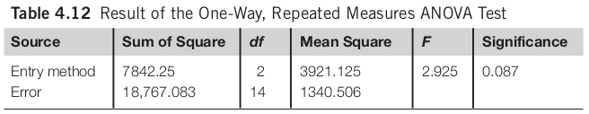
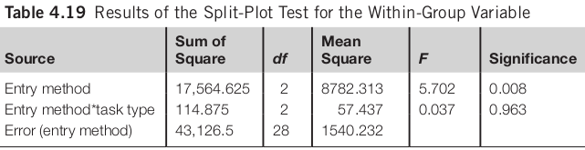

% Statistical Analysis
% Chapter 4
% Dr. Andrew Besmer

# Statistical Analysis

## Prepping Data

* Clean up data
    * Detect Errors/Invalid Data
        * Consider reasonableness: 223 year old?
        * Did you have attention checks?
        * Participant spent 3 seconds per questions?

## Prepping Data
    
* Clean up data
    * Detect Errors/Invalid Data
        * Fix if possible, e.g. contact participant ask age
        * If not possible (no link to identity, failed attention check, etc...), consider removal

## Prepping Data

* Clean up data
    * Format
        * Transform `"I am twenty one in Jan."` -> `20`
        * Better if you can constrain and guide them to valid inputs

## Prepping Data

* Coding
    * Stats tools typically need numerical data
    * `No` -> `0` `Yes` -> `1`
    * `Strongly Disagree` -> `1` `Strongly Agree` -> `7`
    * Be consistent
* May be `scale`, `ordinal` or `nominal` 
    * Examples

## Prepping Data

* Organizing data
    * Accommodate to the requirements of statistical software 
        * May need to combine participant data dispersed in many systems
            * Logs
            * Surveys
            * etc... 

## Descriptive Statistics

* Measures of central tendency
    * Mean
    * Median
    * Mode
* Measures of spread
    * Range
    * Variance
    * Standard deviations

## Comparing Means

## Comparing 2 Means

* Students T-Test
* The most widely adopted method for comparing 2 means
    * Independent-samples t test: between-group design
    * Paired-samples t test: within-group design

## Layout of Independent Samples T Test

## Layout of Paired Samples T Test

## Comparing 2 Means

* Interpretation of t test results:
    * Larger t value: higher probability of the null hypothesis being false
    * t value needs to be reported together with the degree of freedom and the level of significance
* Two-tailed t test vs. one-tailed t test
    * Whether the hypothesis indicates the direction of the difference

## Comparing 2 Means 

> An independent-samples t test suggests that there is significant difference in the task completion time between the group who used the standard word-processing software and the group who used word-processing software with word prediction functions (t(15) = 2.169, p < 0.05).

## Comparing 2 or More Means

* Analysis of variance (ANOVA)
    * Also called F tests
    * One-way ANOVA used for between-group design

## Comparing 2 or More Means

## Comparing 2 or More Means

## Comparing 2 or More Means

> A one-way ANOVA test using task completion time as the dependent variable and group as the independent variable suggests that there is no significant difference among the three conditions (F(2, 21) = 2.174, n.s.).

## Factorial ANOVA

* For between-group design
* 2 or more independent variables involved

## Factorial ANOVA

## Factorial ANOVA

## Factorial ANOVA

> The analysis result suggests that there is no significant difference between
participants who completed the transcription tasks and those who completed the
composition tasks (F(1, 42) = 1.41, n.s.). There is significant difference among participants who used different text entry methods (F(2, 42) = 4.51, p < 0.05).

## Repeated Measures ANOVA

* For within-group design
* Can investigate one or more variables
    * One Way -> One IV w/mult levels
    * Two Way -> Two or More IV w/mult levels

## One Way Repeated Measures ANOVA

## One Way Repeated Measures ANOVA

## Two Way Repeated Measures ANOVA

## Two Way Repeated Measures ANOVA

## Two Way Repeated Measures ANOVA

## Two Way Repeated Measures ANOVA

> The task type has a significant impact on the time spent to complete the task (F(1, 7) = 14.217, p < 0.01). There is no significant difference among the three text entry methods (F(2, 14) = 2.923, n.s.). The interaction effect between the two independent variables is not significant either (F(2, 14) = 0.759, n.s.).

## Split-Plot ANOVA

* Involves both between-group and within-group factors
* Between group task type, within group is entry method
    * Reduces study time/participants needed
    * Controls learning effect somewhat

## Split-Plot ANOVA

## Split-Plot ANOVA

* Between Group Variable (Task Type)

## Split-Plot ANOVA

* Within Group Variable (Entry Method)

## Split-Plot ANOVA

> There is no significant difference between participants who complete com-
position or transcription tasks (F(1, 14) = 0.995, n.s.). There is a significant difference among the three text entry methods (F(2, 28) = 5.702,p < 0.01). The interaction effect between task types and text entry methods is not significant (F(2, 28) = 0.037, n.s.).

## Assumptions 

* Assumptions of t tests and F tests
    * Errors should be independent of each other
        * E.g. two investigators, one provides more instruction
    * Errors should be identically distributed
        * "Homogeneity of variance"
    * Errors should be normally distributed
        * Skewed data (positive or negative)

## Non-parametric Tests

* Non-parametric tests are used when:
    * The error is not normally distributed
    * The distances between any two data units are not equal
    * The variance of error is not equal

## CHI Squared Test

* Used to analyze categorical data
* Table of frequency counts (contingency table)
* Degree of freedom = ( Number of rows - 1 ) x ( Number of columns - 1 )
* Assumptions of the test
    * Data points need to be independent 
    * The sample size should not be too small

## CHI Squared Test

> A CHI Squared Test (χ2 (1) = 10.1, p < 0.05) suggests that the probability of the difference between the rows and columns occurring by chance is less than 0.05 we therefore reject the null hypothesis and conclude that there is a relationship between age and preferred pointing device.

## Non-parametric Tests to Compare Means

* Comparing two groups of data
    * For between-group design: Mann–Whitney U test or the Wald–Wolfowitz runs test
        * Nonparametric alternative to the independent-samples t test
    * For within-group design: Wilcoxon signed ranks test
        * Nonparametric alternative to the paired-samples t test

## Non-parametric Tests to Compare Means

* Comparing three or more groups of data
    * For between-group design: Kruskal–Wallis one-way analysis of variance by ranks
        * Nonparametric alternative to the one-way ANOVA
    * For within-group design: Friedman’s two-way analysis of variance test
        * Nonparametric alternative to the Repeated Measures ANOVA

## Identify Relationships

* Correlation
    * Two factors are correlated if there is a relationship between them
* Most commonly used test is Pearson’s product moment correlation coefficient
* Pearson’s r: ranges between -1 to 1
* Pearson’s r square represents the proportion of the variance shared by the two variables

## Identify Relationships

* Correlation does not imply causal relationship

## Identify Relationships

* Regression
    * Can investigate the relationship between one DV and multiple IVs
* Regression is used for:
    * Model construction
    * Prediction
* Different regression procedures
    * Simultaneous
    * Hierarchical

## Simultaneous Regression

* To find the relationship between DV and IVs as a group
* What percentage of variance does the set of IV's explain in terms of the DV?
* All IVs entered simultaneously

## Simultaneous Regression

## Simultaneous Regression

> There is a significant relationship between task completion time and the independent variables as a group (F(4, 59) = 41.147, p < 0.001). Age, computer experience, target size, and navigation distance explain a total
of 73.6% of the variance in task completion time.

## Hierarchical Regression

* To find the relationship between DV and each IV
* Each IV entered at a time
* Order of IVs depends on the predefined theoretical model
    * Important IVs
    * Covariates

## Hierarchical Regression

## Hierarchical Regression

> Target size explains a significant percentage of the variance (31.9%) in task completion time (F(1, 62) = 29.054, p < 0.001). Navigation distance also has a significant impact on task completion time (F(1, 61) = 8.615, p < 0.01). ... ...

# Questions

## Questions

Questions?