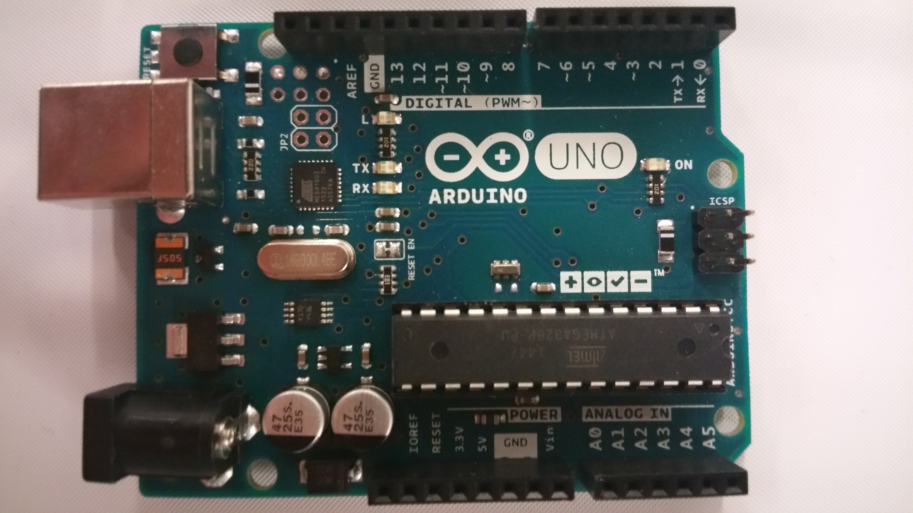
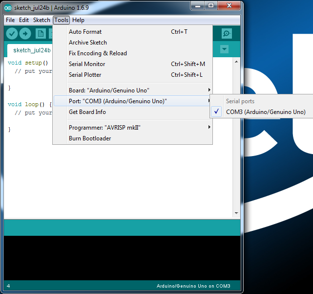
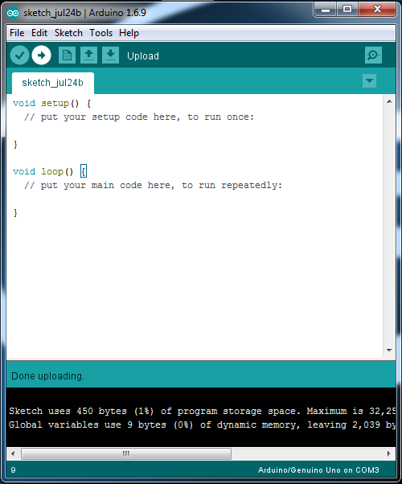

% Feuding Cities
% Andrew Besmer
% http://goo.gl/YjVPYc


# The Game

## The Game

* Physical and Virtual
    * iOS and Android supported
* Battle is Wednesday @ 4PM
* Two ways to play
* Several prizes for various aspects of game

# Kit Components

## Kit Notes

* Limited number of kits
* Free to use but not keep
* Please replace all kit components the way you found them

## Balls

* 3/4 plastic balls serve as ammunition


## Breadboard

* Use with jumper cables/wire
* Some components like buttons etc... fit nicely in it
* Each group of 5 is actually connected


## Arduino Board

* Arduino Uno
    * 16Mhz
    * 14 Digital Inputs/Outputs
    * 6 PWM
    * 6 Analog Inputs
* Three Powering Options (5v)
    * USB (As you work)
    * Power Jack
    * *VIN/GND Pins*

## Arduino Board

* Pin Locations


## Programming the Board

* Use Arduino Software (IDE) to create sketch
* The Arduino language is very similar to (based on) c/c++

```c
//Typically variable/includes

void setup() {
  // put your setup code here, to run once:

}

void loop() {
  // put your main code here, to run repeatedly:

}
```

## Programming with Pins [^sourceArduino]


* Before using a pin you should initialize it setting it's mode using `pinMode()` and the constant `INPUT` or `OUTPUT`

```c

int buttonPin = 12;              // Button connected to digital input 12
int ledPin = 13;                 // LED connected to digital pin 13

void setup()
{
  pinMode(buttonPin, INPUT);
  pinMode(ledPin, OUTPUT);
}

void loop()
{
}
```

## Digital vs Analog

* Analog maps the 0-5v to 0-1023
    * `analogRead(pin)` will return values from 0-1023
    * `analogWrite(pin, value)` will accept values from 0-255
        * Generates a square wave based on duty cycle
        * (0 - 0%), (64 - 25%), (127 - 50%), (255 - 100%)

* Digital maps 0v to `LOW` and 5v to `HIGH`
    * `digitalRead(pin)` will return value of `HIGH` or `LOW`
    * `digitalWrite(pin, value)` will accept values of `HIGH` or `LOW`

## Combining The Two [^sourceArduino]

```c
int ledPin = 9;      // LED connected to digital pin 9
int analogPin = 3;   // potentiometer connected to analog pin 3
int val = 0;         // variable to store the read value

void setup()
{
  pinMode(ledPin, OUTPUT);   // sets the pin as output
}

void loop()
{
  val = analogRead(analogPin);   // read the input pin
  analogWrite(ledPin, val / 4);  // analogRead values go from 0 to 1023, analogWrite values from 0 to 255
}
```


## Uploading Sketch
* Plug in the Arduino using the provided usb cord
* Open the Arduino Software (IDE)
* Select the board included in the kit


## Uploading Sketch

* Select the proper port for the software to communicate with the board on




## Uploading Sketch

* Upload your Sketch




## Motor and Wheel

* Two hobby motors w/gear (up to 12v)
* Two wheels with rubber tires
* Direction the motor spins is based on which way you wire it, switching wires will reverse motor direction

## Servos

* Three high torque servos with variety of attachments
* Run @ 4.8v-6.0v through the arduino
* Rotation is 0-180 degrees
* Three wires
    * Brown - Ground
    * Red - 5v Power
    * Orange - Data from arduino

## Servos

* Note that 0 degree will depend on how you attach the attachments


## Servos

* Use a PWM pin to control the servo
* Use the Arduino Servo Library so that you can work with angles instead of PWM
* Start by attaching the servo and then an angle to it
    * `attach(pin)`
    * `write(angle)` - kit servos support max of 0 to 180

```c
#include <Servo.h>

Servo myservo;

void setup()
{
  myservo.attach(9);
  myservo.write(90);  // set servo to mid-point
}

void loop() {}
```

# Control for Weapons

## Wire

* Run wire from inside the game to outside the safety area
    * Most likely needed for any analog inputs you want to use
* Or maybe you just go random!

## Remote Control

* [http://www.feudingcities.com/remote.html](http://www.feudingcities.com/remote.html)
* Register with me to get one (or more) line(s)
* I expect common usage will be L/R/U/D and FIRE!
* Controls are movable and support multi touch

## Remote Control

* Requires n+1 wires: n inputs + 1 ground
* Supplies digital outputs to your arduino board for input
    * `HIGH`/`LOW`

* Two options are `delay()` and `millis()`, recommend the latter
    * Could also do state tracking, or other custom logic
    
* Both work with milliseconds (1000ms = 1s)
    * `delay(milliseconds)` actually pauses most of your program for specified time
    * `millis()` returns number of milliseconds since the arduino started
        * Requires some custom logic


## Remote Controls


```c
/*
 Modified from:
 http://www.arduino.cc/en/Tutorial/BlinkWithoutDelay
 */

const int ledPin =  13;
int ledState = LOW;

unsigned long previousMillis = 0;        // will store last time LED was updated
const long interval = 1000;           // interval at which to blink (milliseconds)

void setup() {
  pinMode(ledPin, OUTPUT);
}

void loop() {
  unsigned long currentMillis = millis();

  if (currentMillis - previousMillis >= interval) {
    // save the last time you blinked the LED
    previousMillis = currentMillis;

    // if the LED is off turn it on and vice-versa:
    if (ledState == LOW) {
      ledState = HIGH;
    } else {
      ledState = LOW;
    }

    // set the LED with the ledState of the variable:
    digitalWrite(ledPin, ledState);
  }
}
```

## In the Studio

* Table behind this space for programming arduino, getting help
* We have a variety of tools to help you build
    * Laser cutters & cardboard
    * Soldering irons
    * Cutting instruments
    * Much more!
* Firing Range
    * Test Weapons
    * Don't need to register to use remote there

[^sourceArduino]: Source code on this slide based on arduino examples.
